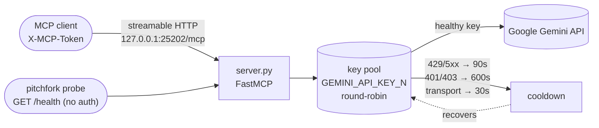

# gemini-mcp

*First-class Gemini API MCP server for the mesh: a self-healing multi-key pool with round-robin + automatic failover, behind one token-gated MCP endpoint.*

   

## Why this exists

- **One key is a single point of failure** — the server pools every `GEMINI_API_KEY_N` in `~/.secrets` and round-robins across the healthy ones, so a rate-limited or revoked key degrades gracefully instead of taking the lane down.
- **Failover is automatic, not manual** — 429/5xx cools a key for 90 s, 401/403 for 600 s, transport errors for 30 s. The pool keeps serving on the next healthy key.
- **Key values never leave `~/.secrets`** — logs, audit trails, and this repo reference keys by label (`GEMINI_API_KEY_2`) or fingerprint only. There is no code path that prints a key.



## Quick Start

```bash
# manual run (normally managed by the pitchfork `gemini-mcp` daemon)
/home/toxic/.awrawr-mcp-venv/bin/python server.py
# readiness probe — no auth, content-free
curl -sf http://127.0.0.1:25202/health
```

## Tools

- `list_models` — available Gemini models across the healthy key pool
- `generate_content(prompt, model, system, temperature, max_output_tokens)` — text generation
- `count_tokens(prompt, model)` — token counting
- `keys_status` — per-key health (labels + fingerprints only, never values)

## Transport

- Streamable HTTP via FastMCP, `127.0.0.1:25202` (override: `GEMINI_MCP_PORT`), path `/mcp`
- Auth: `X-MCP-Token` header must equal `~/.gemini_mcp_token` (0600)
- `GET /health` — no-auth, content-free pitchfork readiness probe
- Tailscale funnel: `https://github-mcp-host.tailc9ac71.ts.net/gemini-mcp` → `127.0.0.1:25202/mcp`

## Key management

Key VALUES live only in `~/.secrets` (0600) as `GEMINI_API_KEY_N` (+ `_NAME`, `_PROJECT`, `_EAP` metadata). The server, logs, audit trail, and this repo never contain key values — logs reference keys by label (`GEMINI_API_KEY_2`) or fingerprint (`AQ.A...1uzA`) only.

Rotation: round-robin over healthy keys; a key is cooled down 90 s on 429/5xx, 600 s on 401/403, 30 s on transport errors. (Verified against `server.py`: `COOLDOWN_S = 90`; explicit 600/30 on the auth/transport paths.)

## Run

Managed by pitchfork (`gemini-mcp` daemon in `/home/toxic/sovereign/pitchfork.toml`). Manual: `/home/toxic/.awrawr-mcp-venv/bin/python server.py`

## SDK

`/home/toxic/.gemini-sdk-venv` holds the maximal Google API SDK surface (`google-generativeai`, `google-ai-generativelanguage`, `google-api-python-client`), refreshed nightly by the `gemini-sdk-refresh.timer` systemd user timer (`ops/`).

## Layout

```text
projects/mesh/gemini-mcp/
├── server.py              # FastMCP server: pool, tools, transport
├── requirements.txt
├── ops/refresh-sdk.sh     # nightly SDK refresh (gemini-sdk-refresh.timer)
└── docs/
    ├── KEY_AUDIT.md       # per-key validity + EAP audit (2026-09-14)
    └── API_INVENTORY.md   # consolidated model/API inventory
```

## Dev / contributing

Changes land as commits in the sovereign-projects repo. Adding a key = exporting one more `GEMINI_API_KEY_N` (with `_NAME`/`_PROJECT`/`_EAP` metadata) into `~/.secrets` — no code change needed; the pool picks it up on restart. Test with `keys_status` before declaring a new key live.

## License & Security

- Follows the sovereign-projects repo licensing.
- Security: key values live only in 0600 `~/.secrets`; auth is a shared `X-MCP-Token` against a 0600 token file; all MCP traffic is loopback-bound (`127.0.0.1:25202`) with the external tailnet funnel as the only outside route; logs and `keys_status` expose labels and fingerprints, never values. Never paste a key value into chat, logs, or issues.
