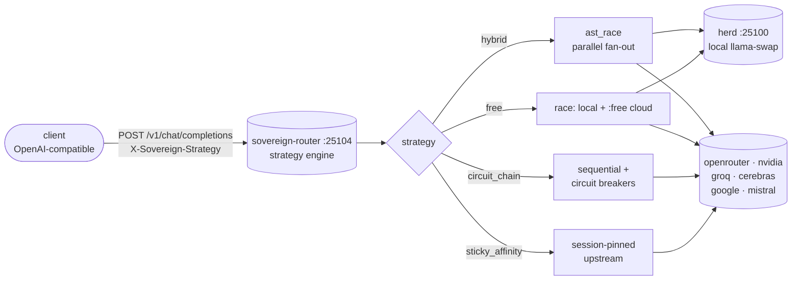

# Sovereign Router

*Multi-provider LLM routing gateway (OpenAI-compatible `/v1/chat/completions`): one request fans out across many upstream providers with strategy-based failover, circuit breakers, sticky sessions, and a WAL health DB.*

   

> Naming note: this was historically called "ast-matrix" / "ast-router" (a codename from the original research angle). It is a **provider router**, not a matrix — the directory is `projects/mesh/router/`.

## Why this exists

- **One endpoint, every provider** — a single OpenAI-compatible API fronts llama-swap, openrouter, nvidia, groq, cerebras, google, and mistral. Clients never rewire when providers change.
- **Zero-cost is a strategy, not a hope** — the `free` strategy races local GPU inference against every `:free` cloud model, so cost-sensitive work never touches a paid endpoint by accident.
- **Self-healing under load** — per-provider circuit breakers (open/half-open), Elo-weighted selection from live success/latency history, and 30-minute sticky sessions for multi-turn coherence.
- **Observable by default** — a self-contained `/ui` dashboard shows the provider matrix, free-tier models, live circuit/Elo state, and a chat box that posts to the real endpoint.



## Quick Start

```bash
# via pitchfork (canonical — the sovereign-router-ts daemon binds :25104)
# or directly:
cd projects/mesh/router/sovereign-router-ts
SOVEREIGN_ROUTER_PORT=25104 bun run router.ts
```

Then:

```bash
curl -H "X-Sovereign-Strategy: free" \
  http://127.0.0.1:25104/v1/chat/completions
```

Open `http://127.0.0.1:25104/ui` for the live dashboard.

## Strategies

Set per request with the `X-Sovereign-Strategy` header.

| Strategy | Behavior |
|----------|-----------|
| `hybrid` (default) | sticky → ast_race → circuit_chain |
| `free` | **races local llama-swap + every `:free` cloud model** (zero-cost) |
| `ast_race` | parallel N providers, first AST/code-shaped response wins |
| `sticky_affinity` | 30-min session pinning for multi-turn |
| `weighted_elo` | dynamic Elo from success/latency |
| `circuit_chain` | sequential with open/half-open circuit breakers |
| `fifo_matrix` | bounded FIFO queue (back-pressure) |

## Layout (this directory)

```text
projects/mesh/router/
├── sovereign-router-ts/   # ← THE LIVE ROUTER (run by pitchfork :25104)
│   └── router.ts          # Bun/TS, self-contained + /ui dashboard
├── sovereign-mcp-gateway/ # MCP trust boundary: circuit breakers, sticky affinity (:25120)
├── flock-py/              # v2 Python router (reference / source-of-truth)
├── flock-router/          # TS/Bun router variant (4-way AST race, reference)
├── free_zed_gateway/      # free-LLM-gateway concept (folded into the `free` strategy)
├── README_COMPLETE.txt    # original research notes
└── bin/                   # router operator scripts
```

## Free providers (maximal integration)

The `free` strategy is the zero-cost path. It builds a candidate pool of:

- **local llama-swap** (always free — `local-fast` / `local-quality` / `local-longctx`)
- **every `:free` model** across keyed cloud providers (OpenRouter's `tencent/hy3:free`, `poolside/laguna-*`, `qwen3-coder:free`, `gemma-4-31b-it:free`, `nemotron-*`, `hermes-3-*`, `gpt-oss-20b:free`, …)

and races them through the *same* parallel/AST-preference/circuit machinery as `ast_race`. So local GPU and free cloud models compete on equal footing, and circuit breakers still apply per provider.

## Endpoints (live router)

| Path | Method | Purpose |
|------|--------|---------|
| `/v1/chat/completions` | POST | route a chat completion |
| `/v1/models` | GET | list model aliases |
| `/health` | GET | provider/circuit/elo summary |
| `/ui` | GET | **self-contained dashboard** (providers, free models, live chat) |
| `/ui/data` | GET | JSON snapshot for external dashboards |
| `/debug/health` `/debug/sqlite` | GET | healing + raw health-DB aggregates |
| `/mesh/*` | GET | GHAS-inspired mesh feature registry |

## Dev / contributing

Changes land as commits in the sovereign-projects repo. The live router is `sovereign-router-ts/router.ts` (Bun); `flock-py/` is the Python reference implementation and `flock-router/` the TS/Bun variant — keep the strategy table above consistent across all three when you change routing behavior. Never run two live routers on `:25104` at once; the pitchfork daemon owns the port.

## License & Security

- Follows the sovereign-projects repo licensing.
- Security: upstream provider keys live only in 0600 files under `/home/toxic/` (e.g. `~/.secrets`) and are never logged or committed; the router binds loopback and is reached externally only via tailnet/funnel routes; `/debug/sqlite` exposes raw health-DB aggregates — treat it as internal. Circuit breakers quarantine misbehaving upstreams automatically.
