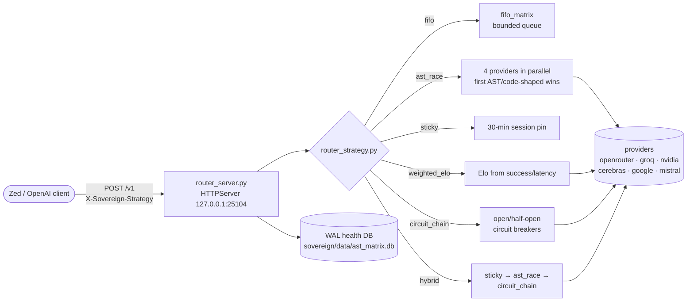

# Sovereign Router v2 (flock-py)

*The Python reference implementation of the sovereign provider router — 6 routing strategies, OpenAI-compatible serving, and a health DB with per-provider Elo.*

   

## Why this exists

- **The source of truth** — `router.py` is the reference implementation every other router variant is ported from; the strategy semantics defined here are what the Bun and TS variants reproduce.
- **Research-backed routing** — strategies draw from RouteLLM (Elo), radlab llm-router (weighted/first_available), agent-router (sticky + circuit), PORT (weighted splits), and LLM-Runner-Router (ensemble/self-healing).
- **Coding-first by default** — the AST race picks the first response that looks like code (def/class/import/function/const/fn/struct, code fences), not just the fastest bytes.



## Quick Start

```bash
cd projects/mesh/router/flock-py
export OPENROUTER_API_KEY=<redacted>   # or GROQ_API_KEY NVIDIA_API_KEY CEREBRAS_API_KEY GOOGLE_API_KEY MISTRAL_API_KEY
python3 router.py                      # serves http://127.0.0.1:25104/v1
```

Then merge `zed_settings.json` into your Zed `settings.json` and pick any routed model.

## Routing strategies (5 + hybrid)

1. **fifo_matrix** — bounded FIFO queue (back-pressure)
2. **ast_race** — parallel 4 providers; first AST/code-shaped response wins
3. **sticky_affinity** — 30 min session sticky for multi-turn
4. **weighted_elo** — dynamic Elo from success/latency
5. **circuit_chain** — sequential with open/half-open circuit breakers
6. **hybrid** (default) — sticky → ast_race of top-weighted → circuit_chain

Header override: `X-Sovereign-Strategy: ast_race` (etc.). Env override: `SOVEREIGN_STRATEGY=hybrid`. Port: `SOVEREIGN_PORT` / `AST_MATRIX_PORT`, default **25104** (router_config.py). Health DB: `SOVEREIGN_DB` (default `/home/toxic/sovereign/data/ast_matrix.db`).

Local club3090 (or any OpenAI-compatible) on `:8020` is auto-eligible.

## Modules

```text
flock-py/
├── router.py            # entry: imports config + strategy, starts router_server.main
├── router_server.py     # HTTPServer on 127.0.0.1:PORT, /v1 endpoints
├── router_config.py     # PORT / DB / PROVIDER_MODELS / PROVIDERS / key_ok / NIM models
├── router_strategy.py   # route_fifo, route_ast_race, route_sticky, route_weighted,
│                        # route_circuit_chain, route_hybrid
├── router_matrix.py     # shared routing state
├── router_health.py     # health tracking
├── router_types.py      # shared types
├── model_checker.py     # model eligibility checks
├── zed_settings.json    # Zed client config to merge
└── lib/                 # flattened ULTIMATE helpers (llm_client, orchestrator,
                         # env_dump, switchover) — import or adapt for deeper health/recovery
```

## NVIDIA NIM (credit-based)

Models prefixed `nim-` route directly to NVIDIA NIM. Registered in `router_config.py`:

- nim-nemotron-super / nim-nemotron-nano
- nim-llama-3.1-70b / nim-llama-3.3-70b
- nim-qwen3.5-397b / nim-qwen3.5-122b
- nim-deepseek-v4-flash

Get a free key at <https://build.nvidia.com> (starts with `nvapi-`), export `NVIDIA_API_KEY` (or `NVIDIA_NIM_API_KEY`), restart the router. In Zed, pick any `nim-*` model from the openai provider list.

## Config

| Env var | Default | Purpose |
|---|---|---|
| `SOVEREIGN_STRATEGY` | `hybrid` | routing strategy |
| `SOVEREIGN_PORT` / `AST_MATRIX_PORT` | `25104` | listen port |
| `SOVEREIGN_DB` | `/home/toxic/sovereign/data/ast_matrix.db` | WAL health DB |
| `OPENROUTER_API_KEY` (+ `GROQ_API_KEY`, `NVIDIA_API_KEY`, `CEREBRAS_API_KEY`, `GOOGLE_API_KEY`, `MISTRAL_API_KEY`) | — | provider keys |

## Dev / contributing

Changes land as commits in the sovereign-projects repo. This is the reference implementation — when you change strategy behavior here, mirror it in `../flock-router/` (Bun port) and keep the strategy table in `../README.md` consistent. Keep provider keys out of the repo; `key_ok` gates providers on key presence.

## License & Security

- Follows the sovereign-projects repo licensing.
- Security: provider API keys come from the environment only — never committed, never logged; the server binds loopback (`127.0.0.1`); the health DB path is configurable so test runs don't touch the live DB. Circuit breakers isolate failing providers automatically.
