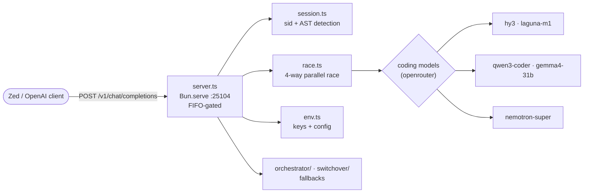

# Sovereign AST Router (flock-router)

*The Bun/TypeScript port of the Python AST router — a 4-way parallel race where the first AST/code-shaped response wins, with sticky sessions and FIFO back-pressure.*

   

## Why this exists

- **Same brain, faster runtime** — a faithful port of `../flock-py/router.py`'s race semantics into Bun/TypeScript, module by module, so the fleet gets the AST race without a Python process.
- **Code-shaped wins, not fastest bytes** — the winner is the first response carrying AST/code signals (`def/class/import/function/const/fn/struct`, code fences), so slow-but-right beats fast-but-chatty.
- **Multi-turn stays coherent** — sticky sessions pin a conversation to its provider for 30 minutes; the FIFO matrix bounds concurrency under burst load.



## Quick Start

```bash
cd projects/mesh/router/flock-router
export OPENROUTER_API_KEY=<redacted>
bun run router.ts   # port from AST_ROUTER_PORT, default 25104
```

Then merge `zed_settings.json` into your Zed (or Zed fork) `settings.json` and use model `auto` — it races up to 4 free providers in parallel; the first response that looks like AST/code wins.

## How it works

- **Parallel race of 4** — `race.ts` fires the coding-model set concurrently (see `CODING` in `race.ts`: `hy3`, `laguna-m1`, `qwen3-coder`, `gemma4-31b`, `nemotron-super`, all via OpenRouter).
- **Winner = first with AST/code signals** — `isAstCode` in `session.ts` scores responses for code shape.
- **FIFO matrix for back-pressure** — `server.ts` gates `/v1/chat/completions` through a FIFO before racing.
- **Failure cooldown + sticky 30 min** — `switchover/` handles provider fallback; sessions stay pinned for multi-turn coherence.
- **Coding-first free models** — from the live free-tier ranking.

## Layout

```text
flock-router/
├── router.ts        # Bun entry (port of router.py)
├── server.ts        # Bun.serve: FIFO-gated /v1/chat/completions + model/health routes
├── race.ts          # 4-way parallel race: first AST/code response wins
├── session.ts       # session id + AST/code detection (isAstCode)
├── env.ts           # provider keys + config (PROVIDERS, keyOk)
├── env_dump.ts      # env diagnostics
├── llm_client/      # provider client helpers
├── orchestrator/    # orchestration helpers
├── switchover/      # failure fallback patterns
├── env_dump/        # env dump helpers
├── zed_settings.json# Zed client config to merge
└── tsconfig.json
```

## Config

| Env var | Default | Purpose |
|---|---|---|
| `AST_ROUTER_PORT` | `25104` | listen port |
| `OPENROUTER_API_KEY` | — | provider key (gates the OpenRouter leg) |

Local club3090 on `:8020` is automatically eligible as `local`.

## Dev / contributing

Changes land as commits in the sovereign-projects repo. This is a port of `../flock-py/` — keep race semantics (winner criteria, cooldowns, sticky duration) identical to the Python reference; divergence between the two is a bug. New code in this tree is Bun/TypeScript per the estate's standing rule.

## License & Security

- Follows the sovereign-projects repo licensing.
- Security: provider keys come from the environment only — never committed, never logged; the server binds loopback by default. The `env_dump` helpers are diagnostics — don't paste their output into issues or chat if keys are present.
