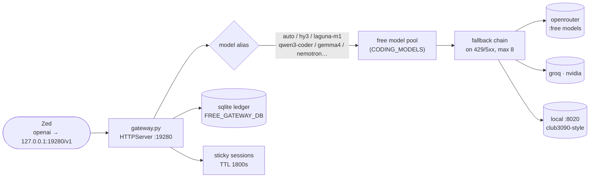

# Free Zed Gateway

*Maximal free coding-agent gateway for Zed — one OpenAI-compatible endpoint that routes across free-tier providers with sticky sessions, fallback chains, and rate-aware selection.*

   

## Why this exists

- **Free coding models, one endpoint** — Zed (or any OpenAI-compatible client) points at `:19280/v1` and gets `auto` routing across every free-tier provider, with no per-provider wiring.
- **Survives rate limits** — fallback on 429/5xx (up to 8 fallbacks), a sqlite rate/usage ledger for rate-aware selection, and sticky 30-minute sessions so multi-turn stays coherent.
- **Runs anywhere** — pure stdlib plus optional `httpx`/`openai`; no framework, no build step, one file.



## Quick Start

```bash
cd projects/mesh/router/free_zed_gateway
export OPENROUTER_API_KEY=<redacted>   # or GROQ_API_KEY, NVIDIA_API_KEY, etc.
python3 gateway.py                     # serves http://127.0.0.1:19280/v1
```

Then merge `zed_settings_snippet.json` into Zed's `settings.json` (`language_models` → `openai` → `api_url: http://127.0.0.1:19280/v1`) and use model `auto`, `hy3`, `laguna-m1`, `qwen3-coder`, etc.

## Model aliases

Coding-first free aliases defined in `gateway.py` (`CODING_MODELS`):

| Alias | Upstream model | Provider |
|---|---|---|
| `auto` | router decides | — |
| `hy3` | `tencent/hy3:free` | openrouter |
| `laguna-m1` / `laguna-xs` | `poolside/laguna-m.1:free` / `poolside/laguna-xs-2.1:free` | openrouter |
| `qwen3-coder` | `qwen/qwen3-coder:free` | openrouter |
| `gemma4-31b` / `gemma4-26b` | `google/gemma-4-31b-it:free` / `google/gemma-4-26b-a4b-it:free` | openrouter |
| `nemotron-super` / `nemotron-nano` | `nvidia/nemotron-3-super-120b-a12b:free` / `nvidia/nemotron-3-nano-30b-a4b:free` | openrouter |
| `north-mini` | `cohere/north-mini-code:free` | openrouter |
| `gpt-oss` | `openai/gpt-oss-20b:free` | openrouter |

Supports club3090-style local as the `local` provider if it's running on `:8020` (override: `LOCAL_LLM_URL`).

## Design lineage

Synthesized from full analysis of three sources:

- <https://github.com/MrFadiAi/free-llm-gateway> — Python gateway, 24+ providers, fallback, rate tracking, dashboard concepts
- <https://github.com/tashfeenahmed/freellmapi> — TS proxy, 28 providers, sticky sessions, routing strategies (priority/balanced/smartest/fastest/reliable), context handoff, encrypted keys, catalog
- <https://github.com/vava-nessa/free-coding-models> — CLI + daemon OpenAI endpoint at `:19280`, ~191 coding models, tool config patching, health probes

The functional merge of their core designs: OpenAI-compat single endpoint, multi-provider fallback chains, sticky sessions, rate-aware selection, coding-model preference — without losing the architectural intent. Expand the `PROVIDERS` dict with more adapters from the freellmapi list as needed (see `providers_expand.md`).

## Config

| Env var | Default | Purpose |
|---|---|---|
| `FREE_GATEWAY_PORT` | `19280` | listen port |
| `FREE_GATEWAY_DB` | `/tmp/free_zed_gateway.db` | sqlite usage/rate ledger |
| `LOCAL_LLM_URL` | `http://127.0.0.1:8020/v1` | local provider base URL |
| `OPENROUTER_API_KEY` (+ `GROQ_API_KEY`, `NVIDIA_API_KEY`, …) | — | provider keys (env or `.env`) |

`STICKY_TTL = 1800` (30 min, like the sources), `MAX_FALLBACKS = 8`.

## Layout

```text
free_zed_gateway/
├── gateway.py               # the gateway: stdlib HTTPServer + ThreadPoolExecutor
├── zed_settings_snippet.json# Zed language_models snippet to merge
└── providers_expand.md      # notes on expanding the PROVIDERS dict
```

## Dev / contributing

Changes land as commits in the sovereign-projects repo. This concept was folded into the sovereign router's `free` strategy — treat new routing ideas as candidates for the live router first, and this file as the standalone/experimental edition. Keep keys in env or `.env`, never in the repo.

## License & Security

- Follows the sovereign-projects repo licensing. The design lineage above links the three upstream projects this was synthesized from — check their licenses before lifting their code wholesale.
- Security: provider keys live in env/`.env` only — never committed; the sqlite ledger defaults to `/tmp` (ephemeral, not backed up); the server binds loopback. Treat `.env` files as secrets: they are gitignored, and pasting them into issues or chat is a leak.
