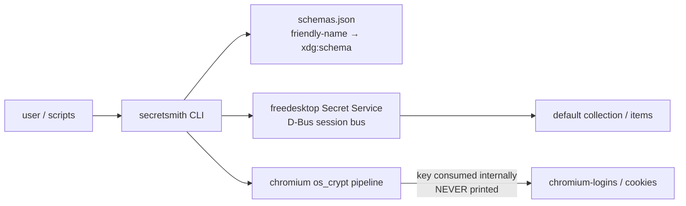

# secretsmith 🔐


> **The maximal freedesktop Secret Service CLI.** A from-scratch Python
> reimplementation of GNOME `secret-tool`'s D-Bus semantics — with a
> friendly schema registry, JSON scripting mode, and a Chromium
> `os_crypt` pipeline that can **never** print the raw key.

Fork lineage: [GNOME/libsecret](https://github.com/GNOME/libsecret)
(`secret-tool`), forked to
[toxicwind/libsecret](https://github.com/toxicwind/libsecret) — this tool
reimplements and maximalizes `secret-tool`'s D-Bus semantics in Python.

**Why it exists.** A real bug started it: a Chromium `os_crypt` key lookup
filtered on `xdg:schema org.freedesktop.Secret.Generic` — a schema Chromium
never uses — and came back empty. `secretsmith` makes that impossible:
**default search has no schema filter**, and `--schema` resolves through the
known-schema registry (`schemas.json`) instead of a raw string you can get
wrong.

## Features

- 🔍 **Schema-free search by default** — the original empty-result bug is impossible
- 📇 **Schema registry** (`schemas.json`): `--schema chromium` instead of memorizing `xdg:schema` URIs; unknown schemas warn, not fail
- 🧪 **JSON mode for everything** (`--json`) — fully scriptable
- 🔒 **Never leaks**: secrets print only under `--show`; `set` reads from stdin/`--secret-file`, never argv (no `ps` snooping)
- 🛡️ **Chromium os_crypt key is never printed on any path** — not with `--show`, not as JSON; `get`/`search --show` on key items is refused *before* the secret is fetched
- 🍪 **Chromium pipeline**: decrypt `Login Data` / cookies in place, key consumed internally, never emitted
- 📦 Single-file CLI (`secretsmith.py`), stdlib + `dbus-python` (+ `cryptography` for Chromium)

## Architecture



## Quick Start

```bash
ln -sf /home/toxic/sovereign/projects/mesh/secretsmith/bin/secretsmith ~/.local/bin/secretsmith
secretsmith check
secretsmith search --schema chromium
```

## Usage

```bash
# health: service reachable, default collection unlocked, Chromium entry readable
secretsmith check

# search everything (no schema filter — the original bug is impossible)
secretsmith search --attr application=chromium

# schema-aware search via the registry
secretsmith search --schema chromium
secretsmith search --schema generic --attr foo=bar

# get exactly one item (errors on 0 or >1 matches)
secretsmith get --attr xdg:schema=org.freedesktop.Secret.Generic --show

# store (secret from stdin or --secret-file; never from argv)
echo -n "s3cr3t" | secretsmith set --label "my api key" --attr service=example
secretsmith set --label k --attr service=ex --secret-file /run/key --replace

# delete (two-step unless --yes)
secretsmith delete --attr service=example --yes

# collections
secretsmith collections
secretsmith collection-create ops --alias default
secretsmith lock default / unlock default

# registry
secretsmith schemas

# Chromium/Chrome os_crypt pipeline (the use case that started this)
secretsmith check                        # key metadata: byte count, AES key candidates
secretsmith chromium-logins              # decrypt ~/.config/chromium/Default/Login Data
secretsmith chromium-logins --profile-dir /path/to/profile --show
secretsmith chromium-cookies

# JSON mode for everything (scriptable)
secretsmith --json search --schema chromium
```

## Safety

Secrets are **never printed without `--show`**. Listings show
`<redacted: N bytes>`. Binary secrets print as base64 under `--show`.
`set` reads from stdin/`--secret-file`, never argv (no `ps` leakage).

The Chromium os_crypt key (`secret_is_key` schemas in `schemas.json`) is
**never printed on any path** — not with `--show`, not as JSON. `get` /
`search --show` on such an item is refused with an error *before* the secret
is even fetched. Decrypt operations (`chromium-logins`, `chromium-cookies`)
consume the key internally and never emit it.

## Schema registry

`schemas.json` maps friendly names to `xdg:schema` values. `chrome` is an
alias of `chromium` (`chrome_libsecret_os_crypt_password_v2`); `generic` is
`org.freedesktop.Secret.Generic` — explicitly documented as *not* what
Chromium uses. Unregistered raw schema strings still work but warn.

## Config

| Env / file | What |
|---|---|
| `DBUS_SESSION_BUS_ADDRESS` | session bus; `bin/secretsmith` defaults it to the user's session bus when unset |
| `schemas.json` | friendly-name → `xdg:schema` registry, extended in place |

Deps: `python3`, `dbus-python`, `cryptography` (Chromium pipeline only).

## Dev

```bash
python3 -m unittest discover -s tests -v          # unit tests (no keyring needed)
SSM_TEST_KEYRING=1 python3 -m unittest discover -s tests -v   # + live D-Bus integration
```

The integration test creates a throwaway collection, round-trips an item,
and deletes the collection.

Layout:

```text
secretsmith/
├── secretsmith.py           # the CLI (single file)
├── schemas.json             # known-schema registry
├── bin/secretsmith          # launcher (PATH install target)
├── tests/test_secretsmith.py
└── README.md
```

## Compat shim

`compat-chromium-keyring.sh` is the source of the old
`/home/toxic/.local/bin/chromium-keyring` stopgap, now a thin shim over
secretsmith (`check` → `secretsmith check`, `attrs` → `secretsmith search
--schema chromium`). The old `key` subcommand was removed — the raw
os_crypt secret is never printed. One truth lives in secretsmith; the shim
exists for muscle memory only.

## License & Security

Fork lineage: GNOME/libsecret (`secret-tool`) → toxicwind/libsecret → this
Python reimplementation of the D-Bus semantics.

**Security posture:** secrets are never printed without `--show`; listings
show `<redacted: N bytes>`; `set` never takes secrets via argv; the Chromium
os_crypt key is unprintable by design on every code path. No network access,
no daemon — the CLI speaks to the local session bus only.
