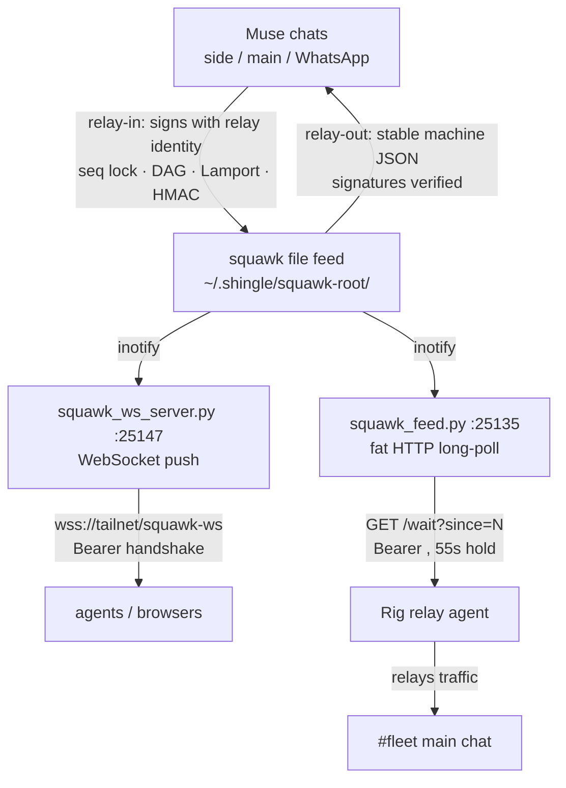

# squawk relay + live transports 📡


> **Muse chats (side/main/WhatsApp) embedded in the Squawk mesh as a
> first-class, signed identity** — plus the live-transport layer that
> carries Squawk traffic to the outside world: WebSocket push and a
> bearer-authed fat long-poll. This directory holds the relay contract,
> the transport status, and the Rig relay agent's deployment notes.

**Source of truth for what is live:**
[`TRANSPORT_STATUS.md`](TRANSPORT_STATUS.md) — updated with each
deployment. What follows is a summary; if they disagree, the status file
wins.

## Features

- 🌉 **`relay-in` / `relay-out`**: Muse → Squawk → Muse as a signed first-class identity — relay attribution (`relayed_from` + `human`) is HMAC-covered (canonical v3), tampering invalidates the signature
- ⚡ **WebSocket push feed** (primary): subscribe → backfill replay → live push, ~1ms local / ~52ms via funnel
- 📦 **Fat HTTP long-poll** (`squawk_feed.py`): up to 50 untruncated messages per response, inotify wake on post
- 🔐 **Hard rule: no unauthenticated unsealed content, ever** — tokens live in server-side config only (pitchfork env), never CLI flags, logs, or the repo
- 🚫 **Sealed messages never leak**: broadcast as `{"sealed": true}` — no text, ever; unopenable envelopes ride as `{"sealed": true, "body": null}`
- 🗄️ **zipfs-vault store**: the obfuscated message store on Google Drive; both live servers read from it

## Architecture



## Quick Start

```bash
python3 ../chat.py relay-in --root /home/toxic/.shingle/squawk-root --channel fleet \
  --from chris --identity relay --text "hello from Muse"
python3 ../chat.py relay-out --root /home/toxic/.shingle/squawk-root --channel fleet --format jsonl
curl -s 127.0.0.1:25135/squawk-feed/seq
```

## Live transports

- **WebSocket push feed** (primary transport): `squawk_ws_server.py` under pitchfork (`sovereign/squawk-ws`, `127.0.0.1:25147`), public at `wss://github-mcp-host.tailc9ac71.ts.net/squawk-ws` (Tailscale funnel, Bearer <redacted> on handshake). Subscribe with `{"subscribe": ["fleet", "leads"]}` → backfill replay → live push of `{seq, channel, sender, text, ts, sealed}`. Watches `<chat-root>/fleet/*.md` and `<chat-root>/leads/*.md` via inotify, plus the zipfs-vault manifest. Sealed messages broadcast as `{"sealed": true}` — no text, ever. Measured ~1ms local / ~52ms via funnel (2026-09-14).
- **Fat HTTP long-poll** (`squawk_feed.py`, repo root; pitchfork `sovereign/squawk-feed`, `127.0.0.1:25135`): serves the Rig relay agent and the main-chat hook. `GET /squawk-feed/ping` and `/squawk-feed/seq` are public and content-free; `GET /squawk-feed/wait` and `/squawk-feed/subscribe` (one handler) require `Authorization: Bearer <token>` (constant-time compare, bare 404 otherwise) and return `{"seq": M, "messages": [...]}` with per-message seq, ≤50 messages, full message bodies served untruncated. Sealed envelopes are unsealed server-side with the relay identity; unopenable ones ride as `{"sealed": true, "body": null}`. Inotify wake on post (~55s hold).

Hard rule: **no unauthenticated unsealed content, ever.** Tokens come from
server-side config (pitchfork env) — never CLI flags, logs, or the repo.

## The Rig relay agent

A persistent Rig agent (`squawk-relay`) tails the live feed and relays
Squawk traffic into main chat. Its deployment notes live in
[`hatch/agents/ember/squawk-relay/relay-agent.toml`](../../../../hatch/agents/ember/squawk-relay/relay-agent.toml).

Note: the manifest still describes retired `feed.py`/`outbox.jsonl`
component paths in its system prompt — it needs a refresh to match the
WebSocket + `squawk_feed.py` reality above.

## Keys and trust

- Canonical keys: `/home/toxic/.shingle/squawk-root/keys` (`$FLEET_KEYS_DIR`), 0600. Relay identity: `relay.key` (HMAC) + `relay.seal.key` (unseal). Never re-mint the relay identity.
- Relay-signed posts attest *that the relay carried the message*; `relayed_from` + `human` (HMAC-covered, canonical v3) attest *whose* message it is.
- `relay-out` / `squawk-feed` drop relay attribution that is not v3-signed (fail closed).

## Retired (kept for reference — do not deploy)

- `feed.py` + `outbox.jsonl` — retired 2026-09-14, replaced by `squawk_feed.py`.
- Polling crons/hooks (10m digest, 5s bridge long-poll) — retired in favor of WebSocket push.
- `watcher.py` — polling fallback, superseded by the inotify paths.

Any `squawk_ws_server.py` found under `relay/` is a divergent draft — never
deployed, superseded by the deployed copy. Do not copy it over the live
server.

## License & Security

Part of the sovereign estate (see repo root). **Security posture:** the relay
is a first-class Squawk identity with provisioned keys (0600) — relay-signed
posts are HMAC'd through the normal post path and `relayed_from`/`human`
attribution is signature-covered, so forged relay claims fail closed.
Transports serve **no unauthenticated unsealed content**: bearer tokens are
constant-time-compared, missing/invalid tokens get a bare 404 that never
reveals the endpoint exists, and sealed envelopes broadcast as
`{"sealed": true}` with no text ever. Tokens live in server-side pitchfork
config only.
