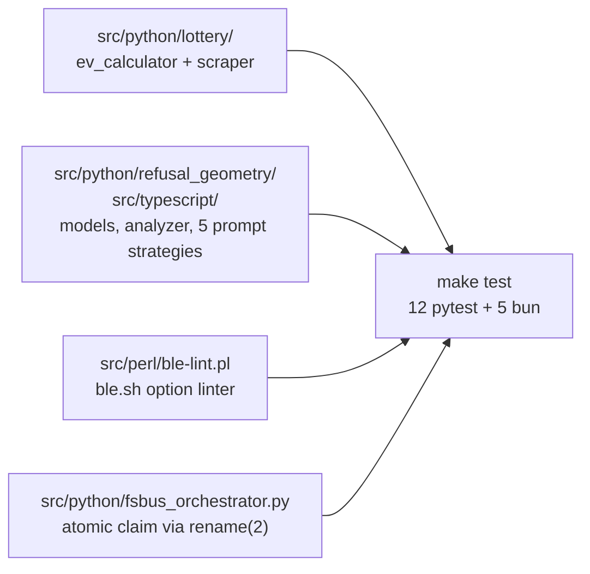

<div align="right">

[](https://github.com/toxicwind/sovereign-projects#license)
[](https://github.com/toxicwind/sovereign-projects)


</div>

# Meta-Research Toolkit

**A polyglot research scaffold for questions that don't fit one language: lottery scratch-off EV analysis, LLM refusal-geometry meta-analysis, and shell tooling.** Bun + Python + Perl, each track in the language that fits it — see `docs/ARCHITECTURE.md` for how the pieces fit and `docs/ITERATION-PLAN.md` for what's next.

- **Lottery EV** — finite-population, without-replacement EV model for Colorado scratch-offs, including a positive-EV "jackpot lag anomaly"
- **Refusal geometry** — meta-analysis toolkit for LLM refusal *routing behavior*, grounded in published 2026 findings, maintained in parallel Python + TypeScript
- **Shell tooling** — dynamic ble.sh option linter with `--fix`
- **Filesystem message bus** — stdlib-only dual-track task bus with atomic claims and 30s leases

## Track map



## Quick start

```bash
python -m venv .venv && source .venv/bin/activate && pip install -r requirements.txt
pytest --cov=src/python --cov-report=html
bun install && bun test
```

`make test` runs both suites (12 pytest + 5 bun). `make lint` runs `ruff check src/python` and `tsc --noEmit`.

## Tracks

- **Lottery EV** (`src/python/lottery/`) — finite-population,
  without-replacement EV model for Colorado scratch-offs.
  `ev_calculator.py` computes baseline EV, top-prize-lag-adjusted dynamic EV,
  and house edge for four audited games (September 2026 snapshot), including
  the Casino Ca$h Chips positive-EV "jackpot lag anomaly".
  `scraper.py` parses Colorado Lottery guideline PDFs and remaining-prize
  pages (PDF URL heuristic documented in-code).
- **Refusal geometry** (`src/python/refusal_geometry/`, `src/typescript/`) —
  meta-analysis toolkit for LLM refusal routing behavior, grounded in
  published 2026 findings (see `docs/refusal-geometry.md`). Five orthogonal
  prompt strategies (`citation_activation`, `self_report_audit`,
  `mechanistic_steering`, `trilemma_argument`, `rule_of_two_framework`)
  maintained in parallel in Python (`prompts.py`) and TypeScript
  (`prompts/orchestrator.ts`); pydantic models (`models.py`) and subspace
  vector math (`analyzer.py`) on the Python side, zod-validated API client
  (`api/meta-client.ts`) and report interfaces (`api/types.ts`) on the TS
  side. All prompts are meta-analytical — they study routing behavior, never
  request harmful content.
- **Shell tooling** (`src/perl/ble-lint.pl`) — dynamic ble.sh option linter:
  discovers valid options by scanning the installed ble.sh source, lints
  `~/.blerc`, `--fix` comments out invalid lines with a timestamped backup.
- **Filesystem message bus** (`src/python/fsbus_orchestrator.py`) —
  stdlib-only dual-track task bus: atomic claim via `rename(2)`, 30s
  leases, 3 attempts, append-only `manifest.jsonl` audit log. Currently has
  no wired consumers (see iteration plan).

## Structure

- `src/python/lottery/` — EV calculator + scraper
- `src/python/refusal_geometry/` — models, analyzer, prompt strategies
- `src/python/fsbus_orchestrator.py` — filesystem message bus
- `src/typescript/` — API client, prompt orchestrator, report types
- `src/perl/` — ble.sh linter
- `tests/` — pytest + Bun test suites
- `docs/` — `refusal-geometry.md` (research notes + citations),
  `ARCHITECTURE.md`, `ITERATION-PLAN.md`

## License + security

MIT — [sovereign-projects](https://github.com/toxicwind/sovereign-projects) ([license](https://github.com/toxicwind/sovereign-projects#license)).

**Security note:** research scaffold — the lottery scraper hits public Colorado Lottery pages (respect their robots/rate limits), and the refusal-geometry prompts are meta-analytical by design (they study routing behavior, never request harmful content). No credentials anywhere in the tree; `ble-lint.pl --fix` only comments out lines in `~/.blerc` with a timestamped backup.
