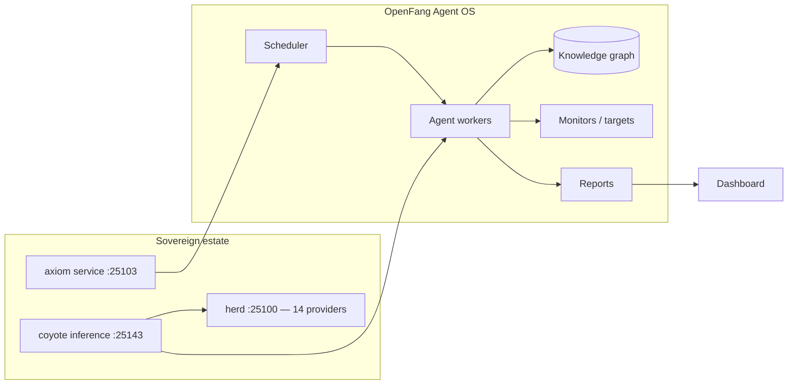

<div align="right">

[](https://github.com/toxicwind/sovereign-projects#license)
[](https://github.com/toxicwind/sovereign-projects)

</div>

# OpenFang — the Agent Operating System

**An open-source Agent OS in Rust.** Not a chatbot framework, not a Python wrapper around an LLM — a full operating system for autonomous agents that work on schedules, 24/7: building knowledge graphs, monitoring targets, generating leads, managing social media, and reporting to a dashboard.

- **Upstream:** <https://github.com/RightNow-AI/openfang>
- **Docs:** <https://openfang.sh/docs>

## Why should I care?

- **Agents that work while you sleep** — scheduled, always-on, with a real dashboard
- **Rust-grade reliability** — the agent runtime is infrastructure, not a demo
- **On this estate** — fronted by the sovereign services stack (`axiom` service on `:25103`, `coyote` inference engine on `:25143` routing through herd across 14 providers)

## Features

- **Scheduled autonomous agents** — recurring missions with reports, not one-shot prompts
- **Knowledge graphs** — agents build and query persistent knowledge
- **Target monitoring** — watch lists with alerting
- **Lead generation + social media management** — long-horizon operational work
- **Live dashboard** — every agent's state visible at a glance

## Architecture



## Quick start (upstream)

```bash
curl -fsSL https://openfang.sh/install | sh
openfang init
openfang start
# Dashboard live at http://localhost:4200
```

## License & security

- OpenFang upstream is open source — see [upstream repo](https://github.com/RightNow-AI/openfang) for its license.
- This monorepo's own files are [MIT](https://github.com/toxicwind/sovereign-projects#license).

## This directory

This directory holds the estate-side notes only — **no OpenFang source is checked in here**. The live work:

- `openfang/` (repo root) — workspace checkout
- [`stack/services/openfang.sh`](../../stack/services/openfang.sh) → [`src/services/openfang.ts`](../../src/services/openfang.ts) — pitchfork **`axiom`** daemon on **:25103**
- pitchfork **`coyote`** daemon — autonomous agent inference engine on **:25143**, an OpenFang agent with Yote integration, routing through herd (`:25100`) across 14 providers

> **Correction (2026-09-14):** an earlier version of this README described OpenFang as a C++ inference-engine fork behind herd with beellama.cpp / llama-cpp-turboquant / ik_llama.cpp. That was wrong — those are llama.cpp engine builds used by herd's backends. OpenFang is the Rust Agent OS described above.

## Contribute

- Issues / PRs go to [upstream](https://github.com/RightNow-AI/openfang).
- Estate integration notes go in this directory; follow the repo's [fleet knowledgebase](../../docs/fleet-knowledgebase.md).
