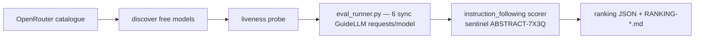

<div align="right">

[](https://github.com/toxicwind/sovereign-projects#license)
[](https://github.com/toxicwind/sovereign-projects)

</div>

# openrouter-probe — quality-first eval stack

**Stop trusting provider labels. Measure which free models actually follow instructions.** A deterministic evaluation harness that ranks OpenRouter's free models by measured instruction-following quality — run through the sovereign **GuideLLM fork** (`toxicwind/guidellm`), not a parallel harness.

**Ranking rule: quality first, provider-free status second, GuideLLM-measured performance third.**

## Why should I care?

- **Deterministic instrument** — sentinel `ABSTRACT-7X3Q` scoring (exact = 2.0, contains = 1.0, missing = 0.0); no LLM-as-judge noise
- **Real tokenizers** — per-model HF tokenizers, so token stats are comparable (fallback models sit in a separate tier, never ranked)
- **Semantics that hold up** — quality aggregates cover *completed* requests only; provider/transport failures (429, overload, `ResourceExhausted`) are reliability signal and never move quality means

## Components

| File | Role |
|---|---|
| `eval_runner.py` | **The runner (permanent).** Discovers live provider-free models from the OpenRouter catalogue, liveness-probes each, runs 6 synchronous GuideLLM requests per model with the deterministic `instruction_following` scorer and per-model real HF tokenizers, then writes raw per-model JSON + aggregate ranking JSON/Markdown. |
| `models-bench.json` | OpenRouter model → HF tokenizer repo manifest. `openrouter/free` has no stable tokenizer (explicitly labelled `gpt2` fallback, not tokenizer-comparable). |
| `ranking-eval-<ts>.json` / `RANKING-eval-<ts>.md` | Aggregate reports. Each names its instrument: scorer, semantics, tokenizer policy, scope, formality tier, prompt, timestamp. |
| `eval-<ts>-<model>.json` | Raw per-model GuideLLM reports (`scores`/`score_details` per request, `quality`/`quality_instrument` at benchmark level). |
| `probe_abstract.py` | Original abstract probe. Semantics borrowed by the fork's scorer. Kept as reference. |
| `probe_all.py`, `deep_pass.py` | Legacy sweep tooling; `guidellm_sweep.sh` moved to `../range/ranch/guidellm/sweeps/` (key: `OPENROUTER_API_KEY_FREE`). |

## Pipeline



## Quick start

```bash
# yote, from this directory:
/home/toxic/.venv-guidellm/bin/python3 eval_runner.py            # all manifest models
/home/toxic/.venv-guidellm/bin/python3 eval_runner.py --models "a/b:free,c/d:free" --n 6
```

The runner reads `OPENROUTER_API_KEY_FREE` from the environment (never logged). GuideLLM source: `/home/toxic/sovereign/projects/range/ranch/guidellm/fork` (remote `toxicwind/guidellm`).

## License & security

- [MIT](https://github.com/toxicwind/sovereign-projects#license).
- API keys are read from the environment and never logged or written to reports.

## Latest ranking

`RANKING-eval-20260920-170706.md` — one clean run through committed code (ranking_lib tier contract), 6 requests/model, prompt `Output exactly: ABSTRACT-7X3Q. No other text.`
Ranking: 9 tokenizer-valid models quality-first; leader `cohere/north-mini-code:free` (quality 2.0, fastest p50).
`openrouter/free` sits in a separate fallback tier (gpt2 fallback tokenizer — never ranked or counted in `results`).
Supersedes `RANKING-eval-20260920-final.md`.

## Semantics (quality policy)

- Every terminal request is scored for its per-request record.
- Completed requests with empty output score `0.0` (model silence is data).
- Scorer exceptions record `0.0` + error metadata, never abort the run.
- **Quality aggregates cover completed requests only.** Provider/transport failures are reliability signal, not instruction-following signal.
- Deterministic instrument only; LLM-as-judge is out of scope for this tier.

## Architecture & links

- Fork: [toxicwind/guidellm](https://github.com/toxicwind/guidellm) — pluggable scoring (`src/guidellm/benchmark/scoring/`), README documents the scoring feature.
- Upstream: [vllm-project/guidellm](https://github.com/vllm-project/guidellm)
- Eval plan: `GUIDELLM_EVAL_PLAN.md` (in this directory)
- Fleet knowledgebase: [canonical](https://github.com/toxicwind/sovereign-projects/blob/main/docs/fleet-knowledgebase.md)
- Papers: Zheng et al. arXiv `2306.05685`; *LLM Judges Have Dark Current* arXiv `2606.15610`; *Judging LLM-as-a-Judge* arXiv `2609.02942`; *Evaluation Scores Are Perishable Knowledge Claims* arXiv `2607.26191`; *RouteBalance* arXiv `2606.17949`; *RouterWise* arXiv `2604.10907`

## Contribute

Standing rules (Chris, 2026-09-20): **no monkeypatching, permanence rule.** The runner is the deliverable; a ranking run is just proof. Keep scorer semantics documented in the report metadata (instrument, tokenizer policy, scope, formality tier, prompt, timestamp).
