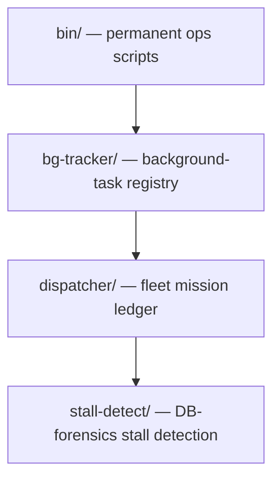

<div align="right">

[](https://github.com/toxicwind/sovereign-projects#license)
[](https://github.com/toxicwind/sovereign-projects)

</div>

# ops — estate operations tooling

**Every fix lives in a real file.** The durable, committed home for operations scripts that used to live as `/tmp` scratch, one-off bridge commands, or hand-applied patches. No monkeypatching — if it's doing a production job, it lives here, committed, and it survives a bridge restart and a full yote reboot.

## Why should I care?

- **/tmp scripts become production jobs silently.** This tree is where they get adopted, documented, and audited.
- **Read-only auditors** — `monkeypatch-detect.sh`, `fleet-health.sh`, `bg-audit` report problems and change nothing; exit 1 on findings.
- **The fleet's mission ledger lives here** — who was admitted to do what, what happened, what got built, who overrode whom.

## Layout



## Suites

| Directory | What |
|---|---|
| [`bin/`](bin/README.md) | `monkeypatch-detect.sh`, `fleet-health.sh`, `sudo-audit.sh`, `missing-files.sh`, `port-audit.sh`, `bg-launch`/`bg-register`/`bg-heartbeat`/`bg-audit`/`bg-kill` — permanent, runnable anytime on yote |
| [`bg-tracker/`](bg-tracker/README.md) | Background-task registry: who/what/why/pid in a durable per-box registry; read-only audit classifies every detached proc; event-driven, no polling |
| [`dispatcher/`](dispatcher/README.md) | **Canonical** fleet dispatcher/ledger: mission/coordinator/worker/relay ID issuance, lifecycle + result tracking, direct-Chris precedence, duplicate-admission locks, append-only hash-chained relay records, exactly-four audit lanes |
| [`stall-detect/`](stall-detect/README.md) | DB-forensics stall detection: executions, tool calls, transcripts, mailbox, recovery ownership — with the executable error-claim runbook |

## Quick start

```bash
projects/ops/bin/monkeypatch-detect.sh   # hunt non-durable fixes (read-only, exit 1 on findings)
projects/ops/bin/fleet-health.sh         # one-shot fleet health audit (read-only)
../bin/bg-audit                          # from bg-tracker/: audit detached procs vs registry
```

## License & security

- [MIT](https://github.com/toxicwind/sovereign-projects#license).
- Auditors here are strictly read-only — they never modify, kill, or restart anything. The kill policy: positive orphan confirmation + a fleet evidence note at kill time; when in doubt, leave it running and flag it.

## Standing rules (Chris, 2026-09-20)

**No monkeypatching. Permanence rule.** Every fix lives in real files — code, configs, systemd units — committed in the correct repo, and must survive a full bridge restart and a full yote reboot. The script is the deliverable; running it once is just proof.

See the repo master README for the estate map, and [`docs/fleet-knowledgebase.md`](../../docs/fleet-knowledgebase.md) §2 for the crew registry.
