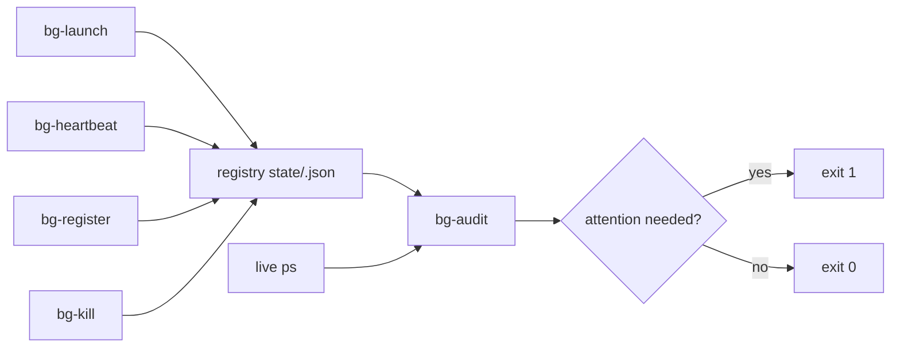

<div align="right">

[](https://github.com/toxicwind/sovereign-projects#license)
[](https://github.com/toxicwind/sovereign-projects)

</div>

# bg-tracker — background-task registry

**Background tasks go blind without a registry.** Nobody knows who spawned what, why it's still alive, or whether it's safe to touch — and stale execution quiet for 12+ hours is extremely bad. This suite fixes that: every backgrounded job launches (or retro-registers) through one launcher, and a read-only audit compares live processes against the registry.

## Why should I care?

- **The ONE correct launcher** — `bg-launch` double-forks in Python: no `&` to mis-scope, records the REAL daemon pid, verifies PPID 1 + own SID before registering
- **Read-only audit** — `bg-audit` classifies every detached proc (KNOWN-SYSTEM / SUPERVISED / REGISTERED-OK / REGISTERED-STALE / REGISTERED-DEAD / UNREGISTERED / AMP-VICTIM), exit 1 when anything needs attention, and never kills
- **Event-driven** — nothing polls on a timer; tasks push their own heartbeats

## Layout

| Component | What |
|---|---|
| `../bin/bg-launch` | The ONE correct launcher — double-fork daemonize, real pid, PPID 1 + own SID verified before registering |
| `../bin/bg-register` | Retro-register an already-running pid |
| `../bin/bg-heartbeat` | Push a liveness heartbeat for a registry id |
| `../bin/bg-audit` | Read-only audit: live `ps` vs registry. Exit 1 when anything needs attention. Never kills |
| `../bin/bg-kill` | Terminate by registry id only, with PID-reuse guard (refuses when the live cmdline no longer matches), SIGTERM → `--force` SIGKILL, marks retired, logs the event. No bulk kills |
| `lib/bgcommon.py` | Shared: flock-guarded registry I/O, box detection, ps scan, append-only event log |
| `state/` | **Gitignored runtime state**: per-box JSON registry, per-box JSONL event log, per-task daemon logs. Survives restart because these are real files on disk |



## Quick start

```bash
# Launch (replaces: cd dir && setsid nohup cmd >>log 2>&1 &)
BG_OWNER=bg-tracker ../bin/bg-launch --name my-task \
  --purpose "why it exists" --workdir /path/to/dir --ttl 3600 \
  -- ./run.sh --flag
../bin/bg-heartbeat "$BG_ID"  # push liveness from the task itself (BG_ID = registry id from launch output)
../bin/bg-audit            # read-only audit
```

## License & security

- [MIT](https://github.com/toxicwind/sovereign-projects#license).
- Kill policy (standing): a kill needs positive orphan confirmation — no heartbeat, no parent task, no fleet registration — plus a fleet note with the evidence at kill time. When in doubt, leave it running and flag it. `bg-kill` refuses on PID reuse so a recycled pid can never be killed by mistake.

## Seeding

Known daemons get retro-registered so the audit stops flagging them:

```bash
../bin/bg-register --pid <pid> --name yote-connector \
  --purpose "hatch<->yote bridge exec lane" --owner bg-tracker
```

Pitchfork-supervised daemons are auto-classified SUPERVISED by `bg-audit` (descendant check against the pitchfork supervisor pid) and need no entries.

## Event-driven hook (opt-in)

No polling daemon ships with this. If you want push-on-change, add a systemd path unit watching `state/` that runs `bg-audit`:

```ini
# /etc/systemd/system/bg-tracker.path
[Path]
PathChanged=/home/toxic/sovereign/projects/ops/bg-tracker/state
[Install]
WantedBy=multi-user.target
```

## Architecture

- Registry I/O is flock-guarded; state is append-only where it matters (event log), so concurrent launchers/audits never corrupt it.
- Heartbeats are caller-driven; audit runs on demand (or from an inotify/systemd-path trigger).

## Deep links

- Estate ops conventions: [`../README.md`](../README.md)
- Fleet knowledgebase: `docs/fleet-knowledgebase.md`
- Standing rules: no monkeypatching, permanence, durability across bridge restart + yote power-cycle. The script is the deliverable.

## Contribute

Keep the audit read-only. Any new classifier must be pure: live-proc facts in, classification out, no side effects. Tests live with the suite — run them before committing.
