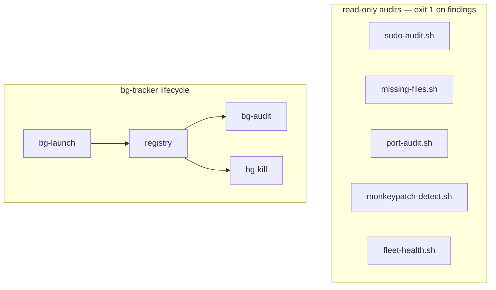

<div align="right">

[](https://github.com/toxicwind/sovereign-projects#license)
[](https://github.com/toxicwind/sovereign-projects)

</div>

# ops/bin — permanent operations scripts

**The script is the deliverable; a one-off run is just proof.** Runnable by anyone, anytime, on yote (CachyOS). Every script here does one estate-wide audit, read-only unless named otherwise.

## Why should I care?

- **Reference-drift hunting** — `missing-files.sh` finds paths the system references but that don't exist (systemd units, live configs, docs)
- **Port sprawl control** — `port-audit.sh` cross-references live listeners against the `config/ports.env` SSOT, pitchfork ready claims, and the Tailscale Serve map
- **Action posture** — `sudo-audit.sh` verifies the pack can actually act (sudo scope, key permissions, tree ownership)
- **Fleet health** — `fleet-health.sh` flags stuck/silent/dead agents in one shot

## Scripts

| Script | What |
|---|---|
| `sudo-audit.sh` | Verifies the pack's action posture: passwordless sudo scope, key paths + permissions, shared-tree ownership (`/home/toxic/sovereign`, `/home/toxic/.tau`), pitchfork/systemd daemon management without interactive auth. Reports blockers; exit 1 if any. `--json` for machine output. |
| `missing-files.sh` | Finds files the system REFERENCES but that don't exist: greps systemd units (`Exec*`/`EnvironmentFile`/`WorkingDirectory`), live configs (`herd.yaml`, `pitchfork.toml`, `ports.env`, …), and docs (`*.md`) for paths, then checks each exists. Prints `MISSING <path>` with the referencing file, line number, and line. `--units` / `--configs` / `--docs` / `--quiet`. |
| `port-audit.sh` | Audits yote fixed-port sprawl: snapshots live TCP listeners via `ss`, cross-references `config/ports.env` (SSOT), `pitchfork.toml` ready_http claims, and the Tailscale Serve backend map; flags duplicate holders, rogue listeners, dead claims, dangling backends (502s), duplicate SSOT names, and EADDRINUSE bind failures. Exit 1 on any finding. `--json` for machine output. |
| `monkeypatch-detect.sh` | Hunts non-durable fixes across the estate: /tmp scripts doing production jobs, shell exports that belong in real config, hand-started daemons with no unit, patched files outside any repo, symlinks into /tmp. Read-only. Exit 1 on findings. |
| `fleet-health.sh` | One-shot fleet channel health audit: stuck/silent/dead agents, erroring loops, watchdog template-spam. Read-only. Exit 1 on findings. `[--hours 24]`. |
| `bg-launch` / `bg-register` / `bg-heartbeat` / `bg-audit` / `bg-kill` | The [bg-tracker](../bg-tracker/README.md) suite — launch, register, heartbeat, audit (read-only), kill by registry id with PID-reuse guard. |



## Quick start

```bash
projects/ops/bin/monkeypatch-detect.sh
projects/ops/bin/port-audit.sh --json
projects/ops/bin/fleet-health.sh --hours 24
```

## License & security

- [MIT](https://github.com/toxicwind/sovereign-projects#license).
- The audit scripts are strictly read-only — they never modify, kill, or restart anything.

## Related docs

- Estate map, crews, repo index, standing rules: [`docs/fleet-knowledgebase.md`](../../../docs/fleet-knowledgebase.md)
- Hardware audit schema (consumed by `hw-audit.service`): [`docs/HARDWARE_AUDIT_20260914.md`](../../../docs/HARDWARE_AUDIT_20260914.md)
- hw-audit masters: [`../../yote/ops/hw-audit/`](../../yote/ops/hw-audit/)
- Master README: [`../../../README.md`](../../../README.md)

## Contribute

New scripts: one audit, one job, read-only by default, exit 1 on findings, `--json` for machine output. Commit here; a one-off in /tmp is not a deliverable.
