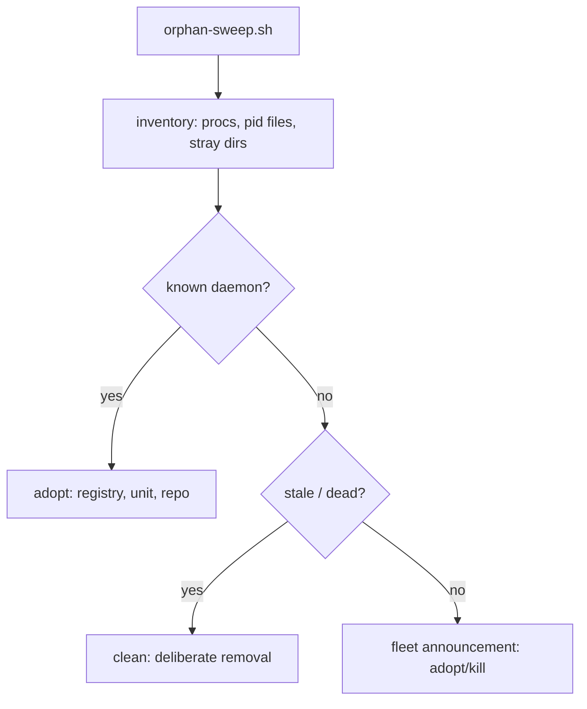

<div align="right">

[](https://github.com/toxicwind/sovereign-projects#license)
[](https://github.com/toxicwind/sovereign-projects)

</div>

# pack-fix — orphan-hunting crew

**Find orphaned stuff on yote and the cell — adopt it or clean it. Never leave a reorg half-done.**

Every estate accumulates strays: processes with no known owner, pid files for dead daemons, half-migrated directory trees, repos that were reorganized twice and landed in neither place. This crew hunts them down and gives each one a disposition: **adopt** (give it a durable home) or **clean** (remove it deliberately, never silently).

## Why should I care?

- **Repeats, permanently** — [`bin/orphan-sweep.sh`](bin/orphan-sweep.sh) is the permanent, repeatable process-orphan audit. Report-only; disposition (adopt/kill) is announced in the fleet channel.
- **Evidence, not vibes** — [`orphan-sweep.md`](orphan-sweep.md) is the evidence log of the 2026-09-20 sweep.
- **Lanes with owners** — per Chris: yote processes only (process inventory vs known daemons, stale pid files); /tmp triage routes to kimi-unlock-audit; repo orphan integration routes to repo-integrator-max.



## Quick start

```bash
projects/pack-fix/bin/orphan-sweep.sh   # report-only orphan audit
```

## License & security

- [MIT](https://github.com/toxicwind/sovereign-projects#license).
- Sweeps are report-only by design — nothing is killed or deleted by the script. Disposition is announced in the fleet channel before any destructive action.

## Crew notes

- [`hesitance-patterns.md`](hesitance-patterns.md) — patterns this crew watches for.
- [`runner-audit.md`](runner-audit.md) — runner lane audit notes.

## Contribute

Every sweep lands evidence in an evidence log (like `orphan-sweep.md`) and dispositions go to fleet. Dead files get deleted deliberately, never silently.

Docs: [sovereign docs](../../docs/) · [master README](../../README.md) · [fleet knowledgebase](../../docs/fleet-knowledgebase.md)
