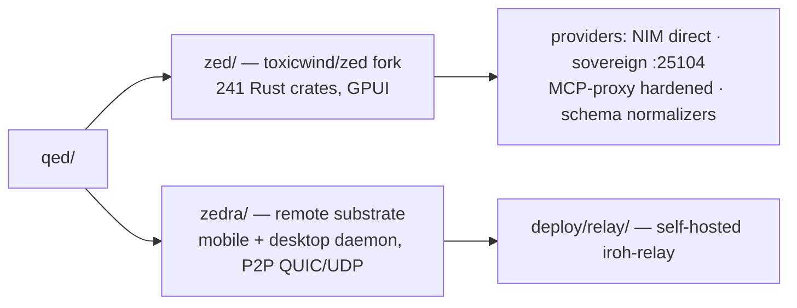

<div align="right">

[](https://github.com/toxicwind/sovereign-projects#license)
[](https://github.com/toxicwind/sovereign-projects)

</div>

# QED — AI-Native Editor Workspace

**The editor layer of the stack.** `qed/` holds the **zed** fork — a high-performance GPU-rendered editor tuned for sovereign's agent stack — and **zedra**, the remote/mobile substrate that puts the editor in your pocket over an encrypted P2P tunnel.

## Why should I care?

- **A zed fork that ships sovereign's provider set** — NVIDIA NIM direct, MCP-proxy-hardened OpenAI-compatible providers, tool-schema normalizers that fix real agent reliability bugs
- **zedra** — read code, view changes, and run AI agents from your phone over QUIC/UDP with end-to-end encryption
- **241 Rust crates of GPUI rendering** — the same UI framework that powers Zed itself

## Layout



```text
qed/
├── zed/     # toxicwind/zed fork — 241 Rust crates, GPUI rendering
│            # custom providers: NVIDIA NIM (direct), MCP-proxy-hardened
│            # OpenAI-compatible providers, tool-schema normalizers
└── zedra/   # remote substrate — mobile editor + desktop daemon with
             # P2P connectivity (see qed/zedra/README.md for its own docs)
```

## Quick start

```bash
# Zed fork builds (241 crates, GPUI)
cargo check --manifest-path qed/zed/Cargo.toml --package zed
# Zedra Rust workspace (7 crates)
cargo check --manifest-path qed/zedra/Cargo.toml --workspace
```

## License & security

- The zed fork's upstream code is primarily **GPL-3.0-or-later** (see `qed/zed/README.md`); sovereign-authored files are [MIT](https://github.com/toxicwind/sovereign-projects#license).
- Editor settings (including provider endpoints) live in `~/.config/zed/settings.json`, not in this repo — no credentials are committed.

## Architecture notes

- The zed fork carries the sovereign provider set (llama-swap on `:25100`, sovereign-router on `:25104`, NVIDIA NIM direct) — editor settings live in `~/.config/zed/settings.json`, not here.
- zedra is the upstream zedra project (mobile + daemon); this tree vendors it for the remote-editing path.
- zedra's Rust workspace resolves against the canonical `qed/zed` tree (no `vendor/` copy): mobile-only gpui crates (`gpui_android`, `gpui_wgpu`, `gpui_ios`) exist in no local zed tree and are commented out in `zedra/crates/zedra/Cargo.toml` — host (linux/macos) builds check clean; re-enable with a mobile-capable zed vendor checkout for Android/iOS builds.

## Verify

```bash
# Zedra TypeScript checks (biome lint + format, 30 files)
bun --cwd qed/zedra run check
```

## Contribute

Patches to the zed fork are upstream-bound where applicable (see `qed/zed/README.md` for the fork's patch inventory). zedra mobile/daemon work follows upstream zedra. Keep the two trees' concerns separate: editor behavior in `zed/`, remote connectivity in `zedra/`.
