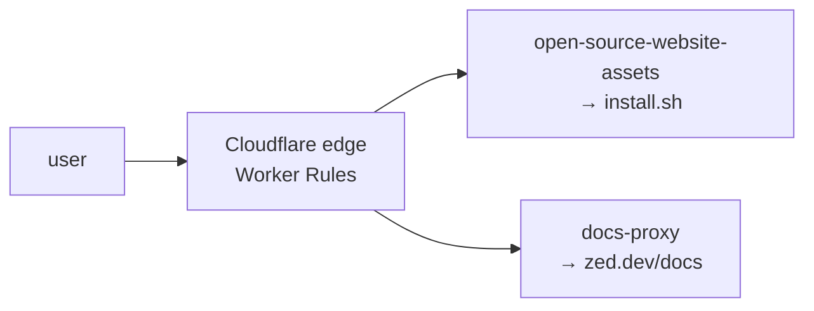

<div align="right">

[](https://github.com/toxicwind/sovereign-projects#license)
[](https://github.com/toxicwind/sovereign-projects)

</div>

# Cloudflare Workers (repo asset serving)

**Two small workers that serve parts of this repo from Cloudflare's edge.** Instead of hammering origin for hot assets, Cloudflare Worker Rules intercept `zed.dev` requests and proxy them to these workers.

| Worker | Serves |
|---|---|
| `open-source-website-assets` | `install.sh` |
| `docs-proxy` | `https://zed.dev/docs` |

## Why should I care?

- **Edge-cached installs** — `install.sh` is served from Cloudflare, fast everywhere
- **Docs behind a proxy** — `zed.dev/docs` requests route through `docs-proxy` to the Cloudflare Pages deployment



## Quick start

```bash
# test a worker locally or deploy a custom version:
npx wrangler dev     # local
npx wrangler deploy  # deploy
```

## License & security

- Zed upstream code is **GPL-3.0-or-later**; this fork ships inside the sovereign-projects monorepo ([MIT](https://github.com/toxicwind/sovereign-projects#license) for sovereign-authored files).
- Workers are public edge functions — keep secrets out of them; they serve assets, not credentials.

## Deployment

These functions are deployed by the docs deployment workflows. During docs deployments, both workers (and the files they depend on) are uploaded to Cloudflare. Worker Rules in Cloudflare intercept requests to `zed.dev` and proxy them to the appropriate workers.

## Testing

You can use [wrangler](https://developers.cloudflare.com/workers/cli-wrangler/install-update) to test these workers locally, or to deploy custom versions.

## Contribute

Asset-serving changes go through the docs deployment workflow — don't hand-deploy unless you're testing. Upstream-bound work belongs to [zed-industries/zed](https://github.com/zed-industries/zed).
