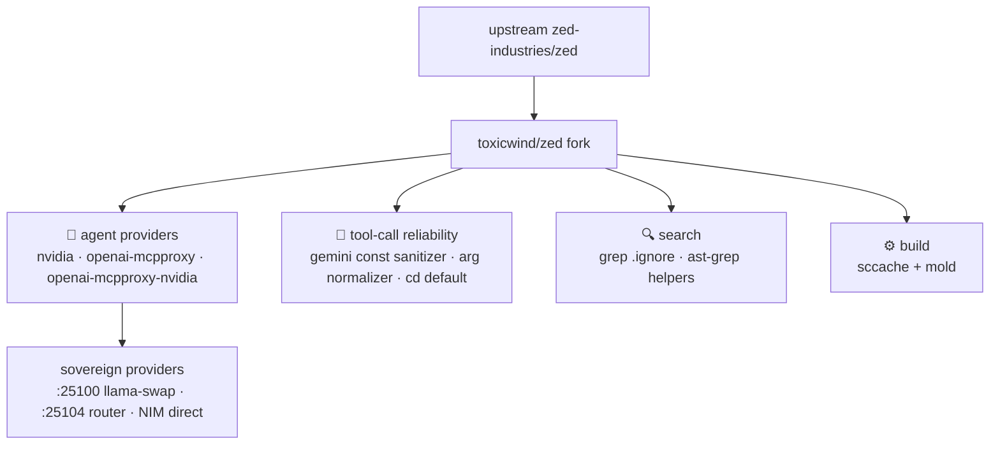

<div align="right">

[](https://zed.dev)
[](https://github.com/zed-industries/zed/actions/workflows/run_tests.yml)
[](https://github.com/toxicwind/sovereign-projects#license)
[](https://github.com/toxicwind/sovereign-projects)

</div>

# Zed

**The high-performance, multiplayer code editor** — from the creators of [Atom](https://github.com/atom/atom) and [Tree-sitter](https://github.com/tree-sitter/tree-sitter). GPU-rendered, Rust-native, and built for the age of AI agents.

---

## 🔱 toxicwind/zed — this fork

*Last synced with upstream: **Jul 20, 2026** — [diff](https://github.com/toxicwind/zed/compare/main...zed-industries:zed:main)*

This is a **thin fork** of [zed-industries/zed](https://github.com/zed-industries/zed) with patches focused on agent reliability, code search, and build toolchain. Every patch is meant for upstream — they just haven't gotten there yet.

### Why should I care?

- **Agent reliability patches** — NVIDIA NIM direct provider, MCP-proxy-hardened OpenAI-compatible providers, tool-schema normalizers that break the infinite retry loop on 120+ tool sets
- **Search that survives the estate** — grep respects `.ignore` (no more OOM on multi-GB trajectory dirs), ast-grep dev helpers
- **Fast rebuilds** — sccache + mold by default



### What's different

Patches are grouped by surface area. Every patch is upstream-bound — they just haven't landed in `zed-industries/zed` yet.

#### 🤖 Agent — language model providers

| Provider | Wire format | Why it exists |
|----------|-------------|---------------|
| **`nvidia`** | Full JSON Schema · `interleaved_reasoning` (msg-level `reasoning_content` round-trip) · no `prompt_cache_key` | First-class NVIDIA NIM (Inkling) route. The generic `openai_compatible` path sends `JsonSchemaSubset`, which collapses `type:["string","null"]` / `oneOf` and makes vLLM/Outlines **500** ("Could not translate instance to regex") on large MCP tool sets → Zed retries forever. `interleaved_reasoning` here populates the Assistant message's `reasoning_content` field (proven accepted by Inkling), so prior thinking survives multi-turn — it is NOT a top-level request param. |
| **`openai-mcpproxy`** | Full JSON Schema · `interleaved_reasoning` · self-healing mapper | OpenAI-compatible endpoint fronted by an mcpproxy compact router. Same hardening as `nvidia` + recovers malformed tool-call args as `{}` instead of looping. |
| **`openai-mcpproxy-nvidia`** | Full JSON Schema · `interleaved_reasoning` · NVIDIA identity | Inkling reached through a third-party OpenAI-compatible gateway (e.g. OpenRouter→Inkling). Avoids the same subset-500 loop on non-NVIDIA routes. |

All three share a **non-destructive tool-schema normalizer** (repairs missing root `type`, untyped properties, bare `null` in multi-type arrays — no tool-count cap, no description truncation) and a **self-healing event mapper** that turns a malformed tool-call parse error into a valid `ToolUse` with `{}` input. This is what breaks the infinite retry loop on 120+ tool sets via `mcpproxy-sovereign`.

*Files:* `crates/language_models/src/provider/{nvidia,openai_mcpproxy,openai_mcpproxy_nvidia}.rs`, `crates/nvidia/`

#### 🤖 Agent — tool-call reliability

| Patch | Why | Files |
|-------|-----|-------|
| **Gemini `const` schema sanitizer** | Gemini rejects `const` in `function_declarations.parameters`. Strips `const`, collapses `anyOf`-with-const → `enum`, drops `if/then/else`. | `crates/google_ai/src/completion.rs` |
| **Tool arg normalizer** | Models emit OpenAI/Anthropic field names (`working_directory`→`cd`, `file_path`→`path`, `query`→`regex`, `content`→`edits`); coerces string→u64 for `timeout_ms`. Kills `thread.rs:1635` validation errors. | `crates/agent/src/tools.rs`, `crates/agent/src/thread.rs` |
| **Terminal `cd` default** | Models that omit `cd` hit a deserialization error; `#[serde(default)]` falls back to `.`. | `crates/agent/src/tools/terminal_tool.rs` |

#### 🔍 Search

| Patch | Why | Files |
|-------|-----|-------|
| **Grep respects `.ignore`** | Multi-GB JSONL/trajectory dirs OOM'd upstream grep; `.ignore` patterns merged into the exclusion matcher. | `crates/agent/src/tools/grep_tool.rs` |
| **ast-grep dev helpers** | Shell wrapper for regex + structural search; `--help` → JSON-schema parser. | `scripts/` |

#### ⚙️ Build & 🔄 Sync

| Area | Patch | Why | Files |
|------|-------|-----|-------|
| **Build** | **sccache + mold** | Default `rustc-wrapper = sccache`, links with `-fuse-ld=mold`; cached build script for fast release rebuilds. | `.cargo/config.toml`, `script/build-release-cached` |
| **Sync** | **`sync-upstream.sh`** | Rebases patches onto latest `origin/main` and force-pushes `fork`. | `sync-upstream.sh` |

### What's *not* in this fork

Language model endpoints, provider configs (OpenRouter, NVIDIA NIM, Google, Mistral, etc.), and API URLs all live in **user settings** (`~/.config/zed/settings.json`) and deploy scripts — not in this git delta. Inference runs on **[llama-swap](https://github.com/toxicwind/llama-swap-main)** (`:25100`). No vLLM.

### Build quick start (≤3 commands)

```bash
cd /home/toxic/projects/zed
./script/build-release-cached
```

Requires `sccache` and `mold` on `PATH` (see `.cargo/config.toml`).

### Remotes

```text
origin  https://github.com/zed-industries/zed.git   (upstream, read-only)
fork    https://github.com/toxicwind/zed.git         (this repo)
```

---

## License & security

- Zed source code is licensed primarily under **GPL-3.0-or-later**, with Apache-2.0 components where marked. License information for third party dependencies must be correctly provided for CI to pass (via [`cargo-about`](https://github.com/EmbarkStudios/cargo-about); see the licensing section below).
- Sovereign-authored files in this monorepo are [MIT](https://github.com/toxicwind/sovereign-projects#license).
- Provider endpoints and API URLs live in user settings (`~/.config/zed/settings.json`), never in this git delta.

## Architecture — crate tour

This fork ships 241 Rust crates. The ones with their own READMEs:

| Crate | README | What |
|---|---|---|
| `agent_skills` | [README](crates/agent_skills/README.md) | Agent Skills (SKILL.md) loading, parsing, catalog, security gates |
| `sandbox` | [README](crates/sandbox/README.md) | Cross-platform sandboxing for shell commands (Seatbelt / bubblewrap) |
| `eval_cli` | [README](crates/eval_cli/README.md) | Headless agent binary for eval/benchmark harnesses |
| `gpui` | [README](crates/gpui/README.md) | GPU-accelerated hybrid immediate/retained UI framework |
| `vim` | [README](crates/vim/README.md) | Vim emulation mode |
| `collab` | [README](crates/collab/README.md) | Collaboration server backend |
| `terminal_view` | [README](crates/terminal_view/README.md) | Integrated terminal (GPUI integration) |
| `icons` | [README](crates/icons/README.md) | Icon set guidelines and contribution |
| `extension_api` | [README](crates/extension_api/README.md) | Rust API for writing Zed extensions |
| `zlog` | [README](crates/zlog/README.md) | Logging facade (`ZED_LOG`) |
| `db` | [README](crates/db/README.md) | SQLite persistence layer |
| `cli` | [README](crates/cli/README.md) | The `zed` command-line launcher |
| `inspector_ui` | [README](crates/inspector_ui/README.md) | Debug-build UI inspector |

## Contribute

### Installation

On macOS, Linux, and Windows you can [download Zed directly](https://zed.dev/download) or install Zed via your local package manager ([macOS](https://zed.dev/docs/installation#macos)/[Linux](https://zed.dev/docs/linux#installing-via-a-package-manager)/[Windows](https://zed.dev/docs/windows#package-managers)).

Other platforms are not yet available:

- Web ([tracking discussion](https://github.com/zed-industries/zed/discussions/26195))

### Developing Zed

- [Building Zed for macOS](./docs/src/development/macos.md)
- [Building Zed for Linux](./docs/src/development/linux.md)
- [Building Zed for Windows](./docs/src/development/windows.md)

### Contributing

See [CONTRIBUTING.md](./CONTRIBUTING.md) for ways you can contribute to Zed.

Also... we're hiring! Check out our [jobs](https://zed.dev/jobs) page for open roles.

### Licensing

Zed source code is licensed primarily under GPL-3.0-or-later, with Apache-2.0 components where marked.

License information for third party dependencies must be correctly provided for CI to pass.

We use [`cargo-about`](https://github.com/EmbarkStudios/cargo-about) to automatically comply with open source licenses. If CI is failing, check the following:

- Is it showing a `no license specified` error for a crate you've created? If so, add `publish = false` under `[package]` in your crate's Cargo.toml.
- Is the error `failed to satisfy license requirements` for a dependency? If so, first determine what license the project has and whether this system is sufficient to comply with this license's requirements. If you're unsure, ask a lawyer. Once you've verified that this system is acceptable add the license's SPDX identifier to the `accepted` array in `script/licenses/zed-licenses.toml`.
- Is `cargo-about` unable to find the license for a dependency? If so, add a clarification field at the end of `script/licenses/zed-licenses.toml`, as specified in the [cargo-about book](https://embarkstudios.github.io/cargo-about/cli/generate/config.html#crate-configuration).

## Sponsorship

Zed is developed by **Zed Industries, Inc.**, a for-profit company.

If you'd like to financially support the project, you can do so via GitHub Sponsors.
Sponsorships go directly to Zed Industries and are used as general company revenue.
There are no perks or entitlements associated with sponsorship.
