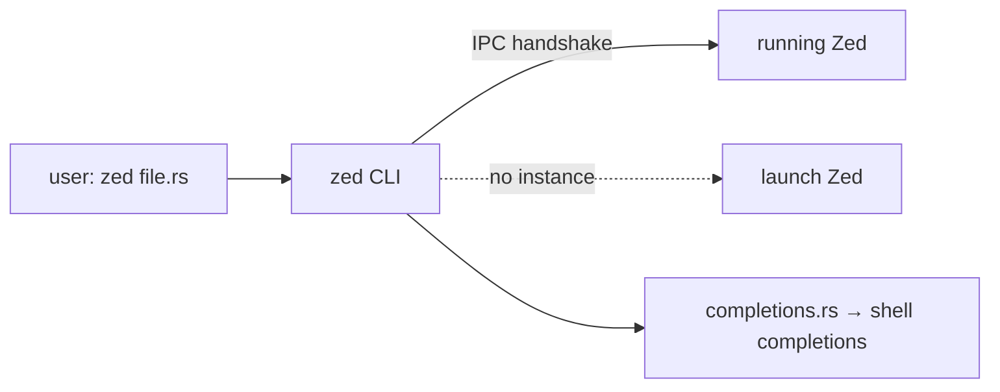

<div align="right">

[](https://github.com/toxicwind/sovereign-projects#license)
[](https://github.com/toxicwind/sovereign-projects)

</div>

# Zed CLI

**The `zed` command-line launcher.** Opens files, directories, and `zed://` URLs in Zed from your terminal — talking to a running instance over IPC, or launching one if none is up. Also generates shell completions.

## Why should I care?

- **Terminal-native workflow** — `zed .`, `zed file.rs:42`, `zed --new` without leaving the shell
- **IPC handshake** — the CLI negotiates with a running Zed (`IpcHandshake`, `CliRequest`/`CliResponse`) instead of blindly spawning processes
- **Shell completions included** — `completions.rs` covers the common shells



## Quick start

```bash
cargo build -p zed            # build the main zed binary first
cargo run -p cli -- --zed ./target/debug/zed
```

## License & security

- Zed upstream code is **GPL-3.0-or-later**; this fork ships inside the sovereign-projects monorepo ([MIT](https://github.com/toxicwind/sovereign-projects#license) for sovereign-authored files).
- Local IPC only — the CLI talks to a Zed instance on your machine.

## Testing

You can test your changes to the `cli` crate by first building the main zed binary:

```sh
cargo build -p zed
```

And then building and running the `cli` crate with the following parameters:

```sh
cargo run -p cli -- --zed ./target/debug/zed
```

## Architecture

- `src/main.rs` — CLI entry point: arg parsing, installed-app detection, launching, IPC client
- `src/cli.rs` — protocol types: `CliRequest`, `CliResponse`, `IpcHandshake`, `OpenBehavior` (`zed -n` semantics)
- `src/completions.rs` — shell completion generation
- `build.rs` — build-time setup

## Contribute

CLI changes affect every user's terminal workflow — test against a real built binary, not just unit tests. Upstream-bound work belongs to [zed-industries/zed](https://github.com/zed-industries/zed).
