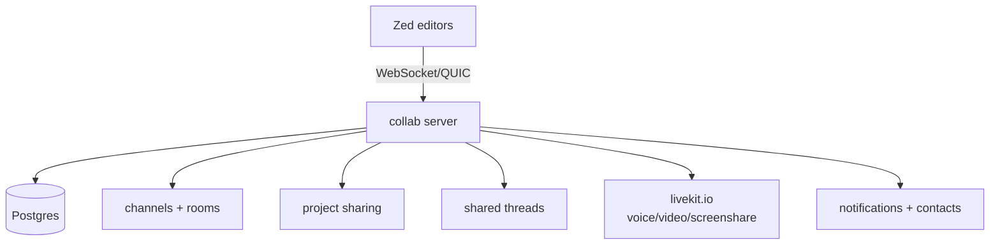

<div align="right">

[](https://github.com/toxicwind/sovereign-projects#license)
[](https://github.com/toxicwind/sovereign-projects)

</div>

# `collab` — the Zed collaboration server

**The backend that makes Zed multiplayer.** A Rust service over WebSocket/QUIC that hosts the shared-state primitives: channels, rooms with live calls, project sharing, shared threads, notification and contact systems, and the buffering/telemetry pipeline.

## Why should I care?

- **Real-time collaboration primitives** — channels, rooms, project sharing, and shared agent threads over a single server
- **Ephemeral call infra** — livekit.io for voice/video/screenshare; ephemeral users are minted from the collab server itself
- **Postgres-backed persistence** — database migrations run automatically at startup via `crates/collab`



## Quick start

```sh
# boot the collab stack via docker compose, then run the server
docker compose up -d postgres
cargo run -p collab --bin collab
```

## License & security

- Zed upstream code is **GPL-3.0-or-later**; this fork ships inside the sovereign-projects monorepo ([MIT](https://github.com/toxicwind/sovereign-projects#license) for sovereign-authored files).
- The collab server handles authentication tokens and user data — deploy it behind TLS with Postgres credentials scoped to the service, and follow the same secrets discipline as any production backend.

## Development

### Requirements

- [Postgres](https://www.postgresql.org/download/) 16+
- [LiveKit](https://livekit.io/) (for voice/video)

### Running the server

```sh
docker compose up -d postgres
cargo run -p collab
```

Database migrations run automatically on startup. The LiveKit integration uses ephemeral users minted by this server — no separate LiveKit user management needed.
