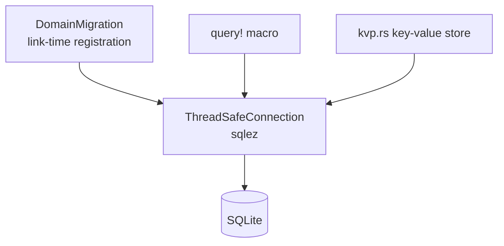

<div align="right">

[](https://github.com/toxicwind/sovereign-projects#license)
[](https://github.com/toxicwind/sovereign-projects)

</div>

# Zed `db` — SQLite persistence layer

**Type-safe SQLite for Zed, minus the boilerplate.** The crate every Zed subsystem uses for local persistence: thread-safe connections, link-time-registered migrations, a `query!` macro for building checked SQL, and a key-value store on top.

## Why should I care?

- **Migrations that register themselves** — `DomainMigration` via `static_connection!` is collected at link time; no central migration registry to forget
- **Thread-safe by construction** — `ThreadSafeConnection` over `sqlez`
- **SQL with guardrails** — the `query!` macro builds checked statements; `kvp.rs` gives you a simple key-value API when you don't need SQL at all



## Quick start

```bash
cargo run --example <your-example>   # build a test db from the examples template
cargo test -p db
```

## License & security

- Zed upstream code is **GPL-3.0-or-later**; this fork ships inside the sovereign-projects monorepo ([MIT](https://github.com/toxicwind/sovereign-projects#license) for sovereign-authored files).
- Local databases only (`paths::database_dir`); nothing leaves the machine.

## Building queries

First, craft your test data. The examples folder shows a template for building a test-db, and can be run with `cargo run --example [your-example]`.

To actually use and test your queries, import the generated DB file into https://sqliteonline.com/.

## Architecture

- `src/db.rs` — connection management, migration plumbing (`Migrator`), re-exports (`sqlez`, `sqlez_macros`, `uuid`, `gpui`)
- `src/query.rs` — the `query!` macro for building type-checked SQL statements
- `src/kvp.rs` — key-value store layered on the same connection

## Contribute

New persistent state should go through this crate's migration system, not ad-hoc files. Upstream-bound work belongs to [zed-industries/zed](https://github.com/zed-industries/zed).
