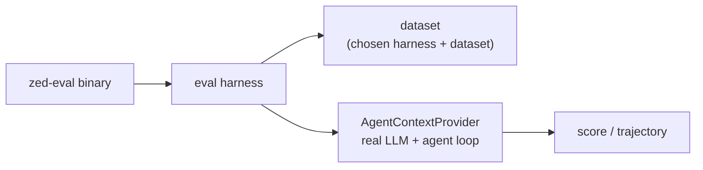

<div align="right">

[](https://github.com/toxicwind/sovereign-projects#license)
[](https://github.com/toxicwind/sovereign-projects)

</div>

# `eval_cli` — headless agent binary for evals

**Run the Zed agent without the UI.** A `zed-eval` binary that evaluates the coding agent against a chosen harness and dataset — the same harness used for internal benchmark runs, now reusable as a general-purpose integration and performance benchmark tool for the agent.

## Why should I care?

- **Benchmark the agent headlessly** — no GUI, no interaction; eval runs are scriptable and CI-able
- **Reusable eval infra** — the harness is general-purpose, not tied to one dataset
- **Production agent internals** — it runs the real `AgentContextProvider` with the full real language model



## Quick start

```sh
cargo run -p eval_cli --release -- <harness> <dataset>
```

(Replace `<harness>` and `<dataset>` with the harness and dataset under test.)

## License & security

- Zed upstream code is **GPL-3.0-or-later**; this fork ships inside the sovereign-projects monorepo ([MIT](https://github.com/toxicwind/sovereign-projects#license) for sovereign-authored files).
- Eval runs execute the full agent loop headlessly, including tool calls — run it against datasets and environments you trust, with credentials scoped to what the eval needs.

This binary is for evaluating the performance of our agent on a chosen dataset against a chosen harness. For more details, see the [zed_eval README](zed_eval/README.md).

See also the [`eval_utils` README](../eval_utils/README.md) for the supporting eval infrastructure (outcome aggregation, progress reporting).
