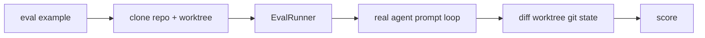

<div align="right">

[](https://github.com/toxicwind/sovereign-projects#license)
[](https://github.com/toxicwind/sovereign-projects)

</div>

# `zed_eval` — benchmark harness for the Zed agent

**A harness for evaluating the coding agent on real repos.** Currently only used by the `eval_cli` binary, but built as a general-purpose integration and performance benchmark tool for the agent — the benchmark machinery itself is not tied to any one dataset.

## Why should I care?

- **Deterministic agent replay** — each eval example gets its own repo clone and worktree; prompts run through the real agent loop and the worktree's git state is diffed for scoring
- **Composable harness** — `EvalRunner` + `Eval` trait; adding a benchmark means implementing one trait
- **Git is the grader** — diffing the worktree keeps scoring language-agnostic



## Quick start

```sh
# invoked via the eval_cli binary; see its README for CLI usage
cargo run -p eval_cli --release -- <harness> <dataset>
```

## License & security

- Zed upstream code is **GPL-3.0-or-later**; this fork ships inside the sovereign-projects monorepo ([MIT](https://github.com/toxicwind/sovereign-projects#license) for sovereign-authored files).
- Evals clone repos and run the agent loop against them — use datasets you trust, in a scratch directory, with credentials scoped to what the benchmark needs.

## Architecture

Each eval example gets its own repo clone and worktree; prompts run through the real agent and the worktree's git state is diffed to score. The `EvalRunner` drives examples through the `Eval` trait, keeping harness logic separate from benchmark definitions.
