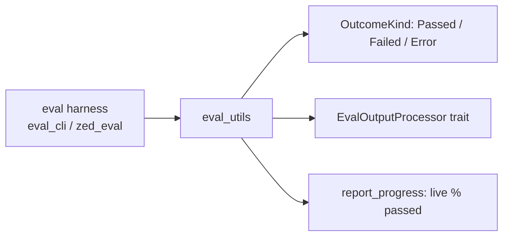

<div align="right">

[](https://github.com/toxicwind/sovereign-projects#license)
[](https://github.com/toxicwind/sovereign-projects)

</div>

# eval_utils — agent eval utilities

**The shared plumbing behind Zed's agent evaluations.** Small, focused helpers for running evals of agents: progress reporting, outcome classification, and output processing — so every eval harness reports results the same way.

## Why should I care?

- **One vocabulary for outcomes** — `OutcomeKind::{Passed, Failed, Error}`: a run that *errored* is not the same as a run that *failed*, and the harness says which
- **Progress you can watch** — `report_progress` prints a live `Evaluated n/m (x.xx% passed)` line as iterations complete
- **Pluggable output handling** — the `EvalOutputProcessor` trait lets harnesses (like `eval_cli` / `zed_eval`) decide what "done" means per task



## Quick start

```rust
use eval_utils::{OutcomeKind, EvalOutputProcessor};

// every agent run resolves to one outcome:
let outcome = match run_result {
    Ok(true) => OutcomeKind::Passed,
    Ok(false) => OutcomeKind::Failed,
    Err(_) => OutcomeKind::Error,
};
```

## License & security

- Zed upstream code is **GPL-3.0-or-later** (Apache-2.0 components where marked); this fork ships inside the sovereign-projects monorepo ([MIT](https://github.com/toxicwind/sovereign-projects#license) for sovereign-authored files).
- No network, no secrets — pure evaluation plumbing.

## Architecture

- `src/eval_utils.rs` — the whole crate: `OutcomeKind`, `EvalOutputProcessor`, `report_progress`.
- Consumed by the agent eval tooling in `crates/eval_cli` (see [eval_cli README](../eval_cli/README.md)).

## Contribute

Keep this crate dependency-light and harness-agnostic: shared vocabulary, not framework. Upstream-bound patches belong to [zed-industries/zed](https://github.com/zed-industries/zed).
