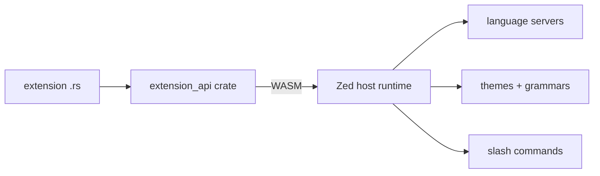

<div align="right">

[](https://github.com/toxicwind/sovereign-projects#license)
[](https://github.com/toxicwind/sovereign-projects)

</div>

# `extension_api` — the Rust API for Zed extensions

**Write Zed extensions in Rust.** This crate defines the stable host↔extension contract: the types and functions an extension uses to talk to Zed, with versioning so extensions keep working across editor releases.

## Why should I care?

- **Stable ABI across releases** — versioned API means extensions don't break every time Zed ships
- **Rust-native** — extensions compile to WASM and run sandboxed in the editor
- **First-class citizens** — language servers, themes, grammars, and slash commands all go through this API



## Quick start

```sh
# scaffold and build a test extension
cargo xtask extension:new my-extension
cargo xtask extension:build my-extension
```

## License & security

- Zed upstream code is **GPL-3.0-or-later**; this fork ships inside the sovereign-projects monorepo ([MIT](https://github.com/toxicwind/sovereign-projects#license) for sovereign-authored files).
- Extensions run as WASM in the editor — the API surface is the security boundary; keep host capabilities least-privilege and treat extension code as third-party.
