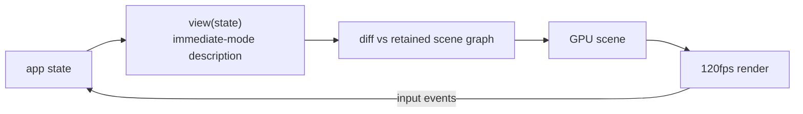

<div align="right">

[](https://github.com/toxicwind/sovereign-projects#license)
[](https://github.com/toxicwind/sovereign-projects)

</div>

# GPUI — GPU-accelerated UI framework

**The framework Zed itself is built on.** GPUI is a hybrid immediate-mode/retained UI framework written in Rust: describe your UI as a function of state, get 120fps GPU rendering with a real retained scene graph underneath.

## Why should I care?

- **Immediate-mode ergonomics, retained-mode performance** — write UI as a function of state; GPUI diffs against a retained scene graph and only repaints what changed
- **GPU-first** — the whole editor (text, cursors, minimap) renders through one GPU pipeline; no DOM, no Electron
- **Platform-native where it matters** — macOS Metal, Linux/Wayland, Windows DirectX backends behind one API



## Quick start

```sh
# run the interactive examples
cargo run -p gpui --example hello_world
```

See [`examples/`](examples/) for the full gallery — each example is a standalone runnable app.

## License & security

- Zed upstream code is **GPL-3.0-or-later**; this fork ships inside the sovereign-projects monorepo ([MIT](https://github.com/toxicwind/sovereign-projects#license) for sovereign-authored files).
- GPUI renders untrusted content (editor text, markdown, HTML previews) — the GPU scene graph treats all content as data; input handling follows platform sandboxing conventions.
