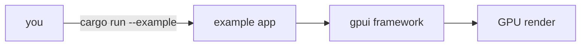

<div align="right">

[](https://github.com/toxicwind/sovereign-projects#license)
[](https://github.com/toxicwind/sovereign-projects)

</div>

# GPUI examples — the interactive gallery

**Learn GPUI by running it.** Every example in this directory is a standalone runnable app — hello world, text input, lists, drag-and-drop, animations, and the kitchen-sink demos. Clone, tweak, re-run.

## Why should I care?

- **Copy-paste learning** — each example is self-contained; steal the pattern you need
- **API coverage** — the gallery exercises views, focus, events, layout, and GPU rendering end to end
- **Instant feedback loop** — `cargo run -p gpui --example hello_world` and you're looking at the pattern



## Quick start

```sh
cargo run -p gpui --example hello_world
cargo run -p gpui --example input
```

## License & security

- Zed upstream code is **GPL-3.0-or-later**; this fork ships inside the sovereign-projects monorepo ([MIT](https://github.com/toxicwind/sovereign-projects#license) for sovereign-authored files).
- Examples are demo code — fine to copy into your own projects, but don't ship them as-is into production without reviewing their error handling.
