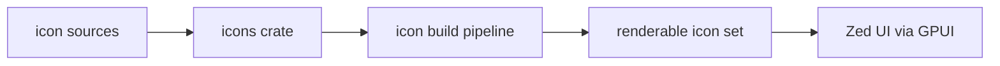

<div align="right">

[](https://github.com/toxicwind/sovereign-projects#license)
[](https://github.com/toxicwind/sovereign-projects)

</div>

# icons — the Zed icon set

**One icon pipeline for the whole editor.** This crate holds Zed's icon assets and the tooling that turns them into the icon font/set the UI renders — plus the contribution guidelines for adding or modifying icons.

## Why should I care?

- **Single source of truth** — every icon in the editor flows through this crate; no scattered SVGs
- **Contribution-friendly** — clear guidelines for naming, sizing, and submitting new icons
- **Font-pipeline** — icons build into the renderable set the GPUI layer consumes



## Quick start

```sh
# add an icon following the guidelines in this crate's docs, then rebuild
cargo build -p icons
```

## License & security

- Zed upstream code is **GPL-3.0-or-later**; this fork ships inside the sovereign-projects monorepo ([MIT](https://github.com/toxicwind/sovereign-projects#license) for sovereign-authored files).
- Icon assets are third-party-derived in places — check per-asset attribution before reusing the set outside Zed.
