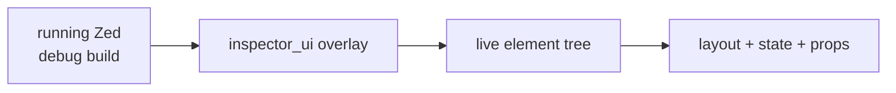

<div align="right">

[](https://github.com/toxicwind/sovereign-projects#license)
[](https://github.com/toxicwind/sovereign-projects)

</div>

# `inspector_ui` — the debug-build UI inspector

**X-ray vision for the GPUI tree.** A debug-build overlay that lets you inspect the live UI element tree — what rendered, where, and with what state — while Zed is running.

## Why should I care?

- **See the render tree live** — inspect elements, layout, and state without printf-debugging the UI
- **Debug builds only** — ships zero overhead in release; it's a development instrument
- **GPUI-native** — understands views, focus, and the retained scene graph



## Quick start

```sh
# build and run Zed in debug mode, then toggle the inspector
cargo run -p zed
# inspector is available in debug builds via the developer commands
```

## License & security

- Zed upstream code is **GPL-3.0-or-later**; this fork ships inside the sovereign-projects monorepo ([MIT](https://github.com/toxicwind/sovereign-projects#license) for sovereign-authored files).
- The inspector exposes internal UI state — it's debug-build-only precisely so it never ships to users.
