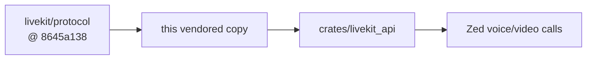

<div align="right">

[](https://github.com/toxicwind/sovereign-projects#license)
[](https://github.com/toxicwind/sovereign-projects)

</div>

# LiveKit Protocol (vendored)

**Pinned copy of the LiveKit protocol definitions.** This directory vendors the [LiveKit protocol](https://github.com/livekit/protocol) at commit [`8645a138fb2ea72c4dab13e739b1f3c9ea29ac84`](https://github.com/livekit/protocol/tree/8645a138fb2ea72c4dab13e739b1f3c9ea29ac84) — the wire contract Zed's collaboration audio/video stack (`livekit_api`) builds against.

## Why should I care?

- **Reproducible builds** — vendoring pins the exact protocol revision instead of floating on upstream
- **Deliberate updates** — bumping the protocol is a conscious diff, not a surprise



## Quick start

```sh
cargo build -p livekit_api   # builds against this vendored protocol
```

## License & security

- LiveKit protocol carries its own upstream license; see the [livekit/protocol](https://github.com/livekit/protocol) repo. Vendoring is pinning, not relicensing.
- Zed code around it is **GPL-3.0-or-later**; sovereign-authored files are [MIT](https://github.com/toxicwind/sovereign-projects#license).

## Contribute

Do not edit vendored files by hand — update by re-vendoring at a new upstream commit and recording the commit hash here.
