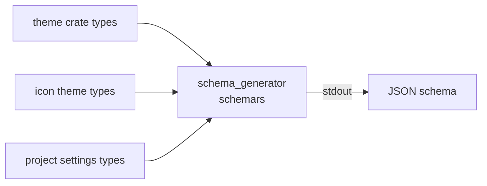

<div align="right">

[](https://github.com/toxicwind/sovereign-projects#license)
[](https://github.com/toxicwind/sovereign-projects)

</div>

# Zed Schema Generator

**Zed's schemas, printed to stdout on demand.** Generates the JSON schemas for Zed's settings surfaces — themes, icon themes, and project settings — straight from the Rust types, so the published schemas never drift from the code that consumes them.

## Why should I care?

- **Single source of truth** — schemas are derived from the actual `ThemeFamilyContent` / `IconThemeFamilyContent` / `ProjectSettingsContent` types via `schemars`, not hand-maintained
- **Tooling fuel** — editors, validators, and the docs site consume these schemas for autocompletion and validation



## Quick start

```sh
cargo run -p schema_generator -- --help
cargo run -p schema_generator -- theme
```

## License & security

- Zed upstream code is **GPL-3.0-or-later**; this fork ships inside the sovereign-projects monorepo ([MIT](https://github.com/toxicwind/sovereign-projects#license) for sovereign-authored files).
- Read-only: prints to stdout, changes nothing.

## Usage

```sh
cargo run -p schema_generator -- --help

cargo run -p schema_generator -- theme
cargo run -p schema_generator -- icon_theme
cargo run -p schema_generator -- project
```

| Schema | Source types |
|---|---|
| `theme` | `theme_settings::ThemeFamilyContent` |
| `icon_theme` | `theme::IconThemeFamilyContent` |
| `project` | `settings::ProjectSettingsContent` |

## Architecture

- `src/main.rs` — the whole crate: clap arg parsing (`SchemaType` value enum), `schemars::schema_for` over the source types.

## Contribute

When a settings type gains a field, no schema file needs updating — the generator picks it up. If a published schema looks stale, re-run this; if it looks wrong, fix the source type. Upstream-bound work belongs to [zed-industries/zed](https://github.com/zed-industries/zed).
