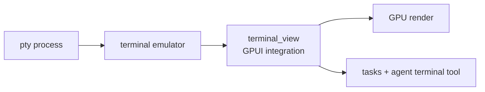

<div align="right">

[](https://github.com/toxicwind/sovereign-projects#license)
[](https://github.com/toxicwind/sovereign-projects)

</div>

# `terminal_view` — the integrated terminal

**A real terminal inside the editor.** GPUI-integrated terminal emulation: PTY management, shell integration, and rendering — the terminal panel you get with `` Ctrl+` `` in Zed.

## Why should I care?

- **GPU-rendered terminal** — scrollback, selection, and ligatures at editor speed
- **Shell integration** — working directory tracking, command detection, task integration
- **First-class citizen** — tasks, the agent's terminal tool, and the debugger all target this surface



## Quick start

```sh
# open Zed and hit the terminal keybinding, or programmatically:
cargo run -p zed
# Ctrl+` toggles the integrated terminal
```

## License & security

- Zed upstream code is **GPL-3.0-or-later**; this fork ships inside the sovereign-projects monorepo ([MIT](https://github.com/toxicwind/sovereign-projects#license) for sovereign-authored files).
- The terminal runs real shell processes with your user's privileges — same trust model as any terminal emulator; the agent's terminal tool is additionally gated by the [sandbox policy](../sandbox/README.md).
