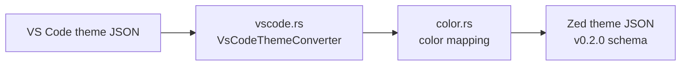

<div align="right">

[](https://github.com/toxicwind/sovereign-projects#license)
[](https://github.com/toxicwind/sovereign-projects)

</div>

# Zed Theme Importer

**Bring your VS Code theme to Zed.** Converts a VS Code color theme JSON file into a Zed theme file — colors, token scopes, and all — so switching editors doesn't mean abandoning the palette you love.

## Why should I care?

- **One command, full theme** — VS Code `.json` theme in, Zed theme JSON out
- **Warns, not silently drops** — `--warn-on-missing` tells you when a value didn't survive the conversion
- **Schema-validated** — output conforms to the Zed theme schema (`https://zed.dev/schema/themes/v0.2.0.json`)



## Quick start

```sh
cargo run -p theme_importer -- dark-plus-syntax-color-theme.json --output output-theme.json
```

## License & security

- Zed upstream code is **GPL-3.0-or-later**; this fork ships inside the sovereign-projects monorepo ([MIT](https://github.com/toxicwind/sovereign-projects#license) for sovereign-authored files).
- Local file conversion only — no network, no uploads.

## Usage details

```sh
cargo run -p theme_importer -- <theme_path> --output <output_path> [--warn-on-missing]
```

| Arg | Meaning |
|---|---|
| `theme_path` | Path to the VS Code theme JSON to import |
| `--output` | Path to write the converted Zed theme |
| `--warn-on-missing` | Warn when theme values have no Zed equivalent |

## Architecture

- `src/vscode.rs` — `VsCodeTheme` parsing and `VsCodeThemeConverter` (scope → Zed token mapping)
- `src/color.rs` — color representation and conversion
- `src/main.rs` — CLI wiring (clap), output serialization

## Contribute

Theme conversion is lossy by nature; improvements to scope coverage are welcome. Upstream-bound work belongs to [zed-industries/zed](https://github.com/zed-industries/zed).
