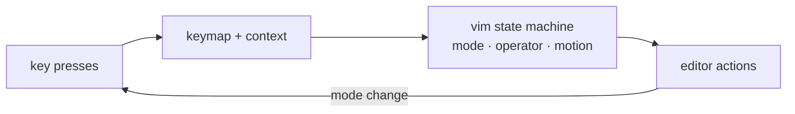

<div align="right">

[](https://github.com/toxicwind/sovereign-projects#license)
[](https://github.com/toxicwind/sovereign-projects)

</div>

# `vim` — Vim emulation for Zed

**Real Vim bindings, native speed.** Full Vim emulation mode for Zed: normal/insert/visual modes, motions, operators, text objects, registers, marks, and ex commands — wired into the editor's keymap system rather than bolted on.

## Why should I care?

- **Deep emulation** — motions, operators, text objects, macros, registers, and marks, not just hjkl
- **Native integration** — participates in Zed's keymap/context system, so bindings compose with editor features
- **Toggle per-project** — enable Vim mode globally or per workspace in settings



## Quick start

```jsonc
// ~/.config/zed/settings.json
{
  "vim_mode": true
}
```

## License & security

- Zed upstream code is **GPL-3.0-or-later**; this fork ships inside the sovereign-projects monorepo ([MIT](https://github.com/toxicwind/sovereign-projects#license) for sovereign-authored files).
- Keybindings are user configuration — no network or privilege surface beyond what the editor already has.
