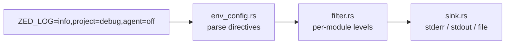

<div align="right">

[](https://github.com/toxicwind/sovereign-projects#license)
[](https://github.com/toxicwind/sovereign-projects)

</div>

# Zlog — Zed's logging facade

**One env var controls all of Zed's logging.** `zlog` is the logging layer behind every Zed application and library: per-module level directives, scoped sinks (stderr / stdout / file), and settings-driven filters — all tuned from the environment.

## Why should I care?

- **Surgical log control** — `ZED_LOG=info,project=debug,agent=off`: global level plus per-crate overrides in one comma-separated string
- **Six levels, zero ceremony** — `off`/`none`, `error`, `warn`, `info`, `debug`, `trace`
- **Scoped to depth 4** — `SCOPE_DEPTH_MAX` keeps module-scoped filtering predictable



## Quick start

```bash
ZED_LOG=info,project=debug,agent=off cargo run -p zed
```

## License & security

- Zed upstream code is **GPL-3.0-or-later**; this fork ships inside the sovereign-projects monorepo ([MIT](https://github.com/toxicwind/sovereign-projects#license) for sovereign-authored files).
- Logs stay local; use `init_output_file` for persistent logs, stderr/stdout for ephemeral.

## Configuration

The general format is:

```
ZED_LOG=info,project=debug,agent=off
```

- Levels can be one of: `off`/`none`, `error`, `warn`, `info`, `debug`, or `trace`.
- You don't need to specify the global level; default is `trace` in the crate and `info` set by `RUST_LOG` in Zed.
- `zlog` also honors `RUST_LOG` as a fallback, and defaults to `info` on CI.

## Architecture

- `src/zlog.rs` — entry points: `init()`, `try_init(filter)`, `init_test()`, plus sink setup (`init_output_file`, `init_output_stderr`, `init_output_stdout`, `flush`)
- `src/env_config.rs` — `ZED_LOG` / `RUST_LOG` parsing
- `src/filter.rs` — directive matching and settings-driven refresh
- `src/sink.rs` — output sinks

## Contribute

Re-exports `log` as `log_impl` — call sites use the standard `log` macros. Keep new sinks behind the same init API. Upstream-bound work belongs to [zed-industries/zed](https://github.com/zed-industries/zed).
