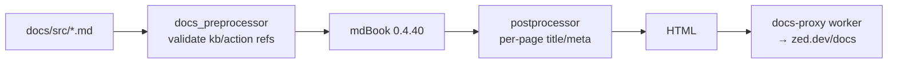

<div align="right">

[](https://github.com/toxicwind/sovereign-projects#license)
[](https://github.com/toxicwind/sovereign-projects)

</div>

# Zed Docs

**The documentation pipeline behind [zed.dev/docs](https://zed.dev/docs).** mdBook source, a custom preprocessor that validates keybinding/action references against the real codebase, and a postprocessor for per-page titles and meta descriptions.

## Why should I care?

- **Docs that can't rot** — the `zed-docs-preprocessor` validates every `{#kb …}` and `{#action …}` reference against the action manifest; stale references fail the build
- **Per-page SEO** — the postprocessor injects front-matter `title`/`description` into each page's `<head>`
- **Pinned toolchain** — mdBook 0.4.40 (0.4.48 breaks URLs); the Nix shell provides it pinned, no install needed



## Quick start

```sh
script/generate-action-metadata   # dump action manifest (re-run when actions change)
mdbook serve docs
```

## License & security

- Zed upstream code is **GPL-3.0-or-later**; this fork ships inside the sovereign-projects monorepo ([MIT](https://github.com/toxicwind/sovereign-projects#license) for sovereign-authored files).
- Binary assets (images, videos) must NOT be committed — upload to zed.dev or GitHub's asset storage and link out, or the repo bloats.

## Preview locally

To preview the docs locally you will need to install [mdBook](https://rust-lang.github.io/mdBook/) (`cargo install mdbook@0.4.40`), generate the action metadata, and then serve:

```sh
script/generate-action-metadata
mdbook serve docs
```

The first command dumps an action manifest to `crates/docs_preprocessor/actions.json`. Without it, the preprocessor cannot validate keybinding and action references in the docs and will report errors. You only need to re-run it when actions change.

If you use Nix, the development shell provides a pinned `mdbook` (0.4.40) and a prebuilt docs preprocessor, so you can build the docs without installing anything or compiling the preprocessor on every run:

```sh
nix develop -c mdbook build docs
```

(When `actions.json` has not been generated, action/keybinding validation is skipped with a warning rather than failing the build.)

It's important to note the version number above. For an unknown reason, as of 2025-04-23, running 0.4.48 will cause odd URL behavior that breaks things.

Before committing, verify that the docs are formatted in the way Prettier expects with:

```
cd docs && pnpm dlx prettier@3.5.0 . --write && cd ..
```

## Architecture

### Preprocessor

We have a custom mdBook preprocessor for interfacing with our crates (`crates/docs_preprocessor`).

If for some reason you need to bypass the docs preprocessor, you can comment out `[preprocessor.zed-docs-preprocessor]` from the `book.toml`.

### Images and videos

To add images or videos to the docs, upload them to another location (e.g., zed.dev, GitHub's asset storage) and then link out to them from the docs.

Putting binary assets such as images in the Git repository will bloat the repository size over time.

### Internal notes

- We have a Cloudflare router called `docs-proxy` that intercepts requests to `zed.dev/docs` and forwards them to the "docs" Cloudflare Pages project.
- The CI uploads a new version to the Cloudflare Pages project from `.github/workflows/deploy_docs.yml` on every push to `main`.

### Table of Contents

The table of contents files (`theme/page-toc.js` and `theme/page-doc.css`) were initially generated by [`mdbook-pagetoc`](https://crates.io/crates/mdbook-pagetoc).

Since all this preprocessor does is generate the static assets, we don't need to keep it around once they have been generated.

## Referencing keybindings and actions

When referencing keybindings or actions, use the following formats:

### Keybindings

{#kb scope::Action} - e.g., {#kb zed::OpenSettings}.

This will output a code element like: `<code>Cmd + , | Ctrl + ,</code>`. We then use a client-side plugin to show the actual keybinding based on the user's platform.

By using the action name, we can ensure that the keybinding is always up-to-date rather than hardcoding the keybinding.

#### Keymap overlays

`{#kb:keymap_name scope::Action}` - e.g., `{#kb:jetbrains editor::GoToDefinition}`.

This resolves the keybinding from a keymap overlay (e.g., JetBrains) first, falling back to the default keymap if the overlay doesn't define a binding for that action. This is useful for sections where the documentation expects a special base keymap to be configured.

Supported overlays: `jetbrains`.

### Actions

{#action scope::Action} - e.g., {#action zed::OpenSettings}.

This will render a human-readable version of the action name, e.g., "zed: open settings", and will allow us to implement things like additional context on hover, etc.

### Creating new templates

Templates are functions that modify the source of the docs pages (usually with a regex match and replace).
You can see how the actions and keybindings are templated in `crates/docs_preprocessor/src/main.rs` for reference on how to create new templates.

## Consent banner

We pre-bundle the `c15t` package because the docs pipeline does not include a JS bundler. If you need to update `c15t` and rebuild the bundle, use:

```
mkdir c15t-bundle && cd c15t-bundle
npm init -y
V="$NEW_C15T_VERSION"   # set to the c15t version you are installing
npm install "c15t@$V" esbuild
echo "import { getOrCreateConsentRuntime } from 'c15t'; window.c15t = { getOrCreateConsentRuntime };" > entry.js
npx esbuild entry.js --bundle --format=iife --minify --outfile="c15t@$V.js"
cp "c15t@$V.js" "../theme/c15t@$V.js"
cd .. && rm -rf c15t-bundle
```

Then update `book.toml` to reference the new bundle filename.

### References

- Template Trait: `crates/docs_preprocessor/src/templates.rs`
- Example template: `crates/docs_preprocessor/src/templates/keybinding.rs`
- Client-side plugins: `docs/theme/plugins.js`

## Postprocessor

A postprocessor is implemented as a sub-command of `docs_preprocessor` that wraps the built-in HTML renderer and applies post-processing to the HTML files, to add support for page-specific title and `meta` tag description values.

An example of the syntax can be found in `git.md`, as well as below:

```md
---
title: Some more detailed title for this page
description: A page-specific description
---

# Editor
```

The above code will be transformed into (with non-relevant tags removed):

```html
<head>
  <title>Editor | Some more detailed title for this page</title>
  <meta name="description" contents="A page-specific description" />
</head>
<body>
  <h1>Editor</h1>
</body>
```

If no front matter is provided, or if one or both keys aren't provided, the `title` and `description` will be set based on the `default-title` and `default-description` keys in `book.toml` respectively.

### Implementation details

Unfortunately, mdBook does not support post-processing like it does pre-processing, and only supports defining one description to put in the `meta` tag per book rather than per file.
So in order to apply post-processing (necessary to modify the HTML `head` tags) the global book description is set to a marker value `#description#` and the HTML renderer is replaced with a sub-command of `docs_preprocessor` that wraps the built-in HTML renderer and applies post-processing to the HTML files, replacing the marker value and the `<title>(.*)</title>` with the contents of the front matter if there is one.

### Known limitations

The front matter parsing is extremely simple, which avoids needing to take on an additional dependency, or implement full YAML parsing.

- Double quotes and multi-line values are not supported, i.e. Keys and values must be entirely on the same line, with no double quotes around the value.

The following will not work:

```md
---
title: Some
  Multi-line
  Title
---
```

neither this:

```md
---
title: "Some title"
---
```

- The front matter must be at the top of the file, with only white-space preceding it.
- The contents of the `title` and `description` will not be HTML escaped. They should be simple ASCII text with no unicode or emoji characters.

## Contribute

Docs changes need `script/generate-action-metadata` re-run when actions change, and Prettier formatting before commit. Built on push to `main`, published automatically to [zed.dev/docs](https://zed.dev/docs).
