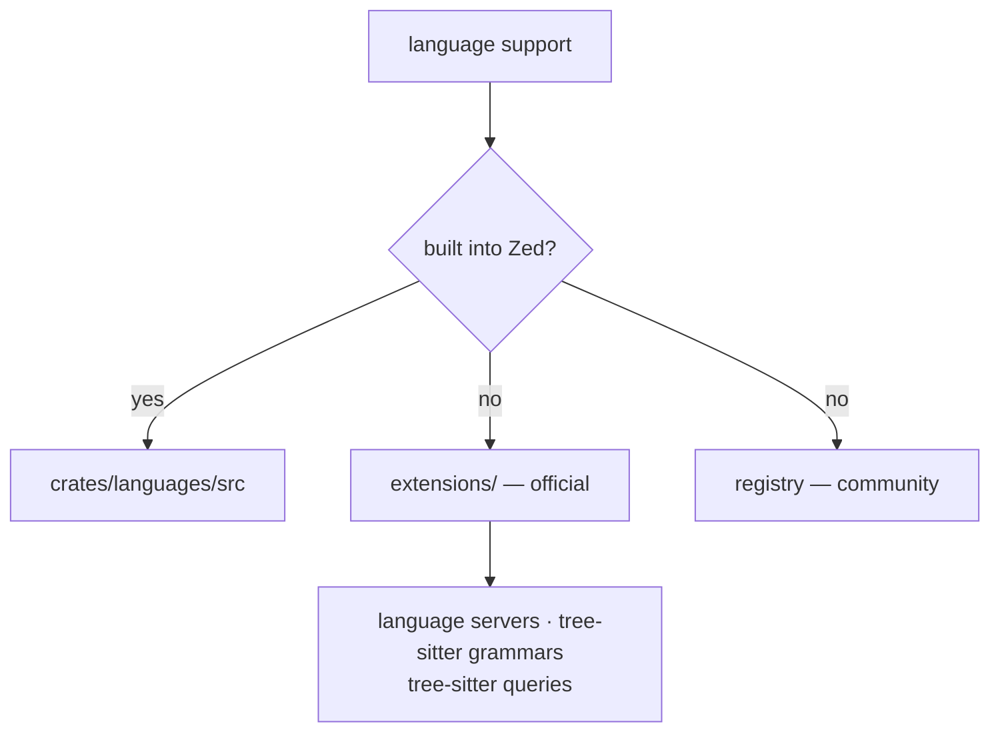

<div align="right">

[](https://github.com/toxicwind/sovereign-projects#license)
[](https://github.com/toxicwind/sovereign-projects)

</div>

# Zed Extensions (officially maintained)

**Languages for Zed, maintained by the Zed team.** This directory contains extensions that live in the Zed repository for ease of maintenance. Looking for the full registry? See [`zed-industries/extensions`](https://github.com/zed-industries/extensions).

## Why should I care?

- **Official quality bar** — these extensions ship the same `zed_extension_api` every third-party extension uses, so they're the reference implementation
- **Languages without extensions** — many languages are built in (see [`crates/languages/src`](https://github.com/zed-industries/zed/tree/main/crates/languages/src)); everything else arrives as an extension here



## Quick start

```bash
# install one locally for development (from the Zed command palette):
# zed: extensions → Install Dev Extension → pick the extension directory
```

## License & security

- Zed upstream code is **GPL-3.0-or-later**; this fork ships inside the sovereign-projects monorepo ([MIT](https://github.com/toxicwind/sovereign-projects#license) for sovereign-authored files).
- Extensions run as WASM — sandboxed by design. Dev extensions you install yourself run with your trust; review before installing.

## Structure

Currently, Zed includes support for a number of languages without requiring installing an extension. Those languages can be found under [`crates/languages/src`](https://github.com/zed-industries/zed/tree/main/crates/languages/src).

Support for all other languages is done via extensions. This directory contains some of the officially maintained extensions. These extensions use the same [zed_extension_api](https://docs.rs/zed_extension_api/latest/zed_extension_api/) available to all [Zed Extensions](https://zed.dev/extensions) for providing [language servers](https://zed.dev/docs/extensions/languages#language-servers), [tree-sitter grammars](https://zed.dev/docs/extensions/languages#grammar) and [tree-sitter queries](https://zed.dev/docs/extensions/languages#tree-sitter-queries).

You can find the other officially maintained extensions in the [zed-extensions organization](https://github.com/zed-extensions).

## Dev extensions

See the docs for [Developing an Extension Locally](https://zed.dev/docs/extensions/developing-extensions#developing-an-extension-locally) for how to work with one of these extensions. The test fixture used by the extension crate's test suite lives in [`test-extension/`](test-extension/README.md).

## Contribute

New language support starts here if the Zed team maintains it, or in the [registry](https://github.com/zed-industries/extensions) for community extensions. Every extension needs an `extension.toml` manifest — see [the extension API README](../crates/extension_api/README.md).
