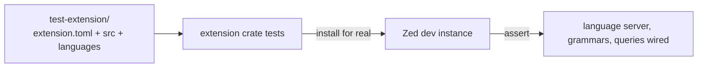

<div align="right">

[](https://github.com/toxicwind/sovereign-projects#license)
[](https://github.com/toxicwind/sovereign-projects)

</div>

# Test Extension

**The fixture the extension system tests against.** A minimal, fully-formed Zed extension used in the `extension` crate's test suite — a real extension on disk that the tests load, install, and exercise, so the harness tests reality instead of mocks.

## Why should I care?

- **End-to-end extension testing** — tests install this extension for real (manifest, WASM build, language config), catching integration breakage unit tests miss
- **Originally based on the Gleam extension** — a real-world shape, not a toy



## Quick start

```bash
cargo test -p extension
```

## License & security

- Zed upstream code is **GPL-3.0-or-later**; this fork ships inside the sovereign-projects monorepo ([MIT](https://github.com/toxicwind/sovereign-projects#license) for sovereign-authored files).
- Test fixture only — never published to the extension registry.

## Layout

```
test-extension/
  extension.toml   # manifest: id, name, version, schema_version
  src/             # extension source (compiled to WASM by the test harness)
  languages/       # language + grammar config under test
```

See [`crates/extension_api`](../../crates/extension_api/README.md) for the API this fixture exercises, and the [extensions README](../README.md) for how real extensions are structured.

## Contribute

If the extension API gains a surface that tests should cover, extend this fixture first — it's the canonical "real extension" the test suite knows. Upstream-bound work belongs to [zed-industries/zed](https://github.com/zed-industries/zed).
