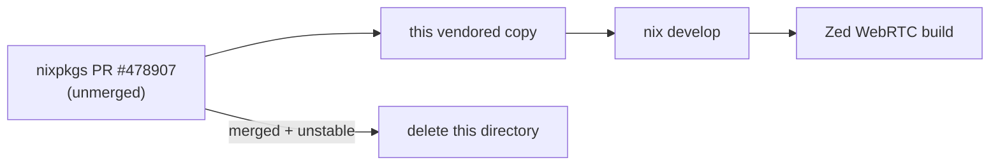

<div align="right">

[](https://github.com/toxicwind/sovereign-projects#license)
[](https://github.com/toxicwind/sovereign-projects)

</div>

# Vendored livekit-libwebrtc build (Nix)

**A stopgap, clearly labeled as one.** The contents of this directory are vendored from [nixpkgs PR #478907](https://github.com/NixOS/nixpkgs/pull/478907) — the libwebrtc build Zed's Nix shell needs before the PR lands upstream.

## Why should I care?

- **Unblocks Nix builds today** — without this vendored copy, the Nix dev shell can't build the WebRTC dependency
- **Self-removing** — it should be deleted as soon as the PR is merged and the new libwebrtc hits nixpkgs-unstable



## Quick start

```sh
nix develop   # consumes this vendored libwebrtc automatically
```

## License & security

- Upstream licensing follows nixpkgs/livekit-libwebrtc terms; this is a temporary vendor, not a fork.
- Zed code around it is **GPL-3.0-or-later**; sovereign-authored files are [MIT](https://github.com/toxicwind/sovereign-projects#license).

## Contribute

Track [nixpkgs#478907](https://github.com/NixOS/nixpkgs/pull/478907). When it merges and the new libwebrtc reaches nixpkgs-unstable, delete this directory — do not maintain it.
