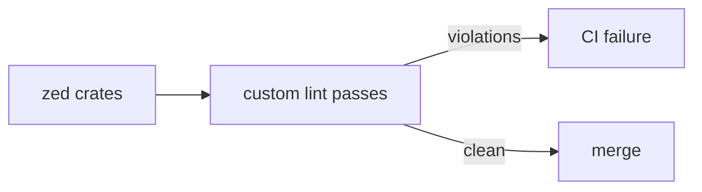

<div align="right">

[](https://github.com/toxicwind/sovereign-projects#license)
[](https://github.com/toxicwind/sovereign-projects)

</div>

# tooling/lints — Zed's custom Rust lints

**Project-specific Clippy-grade rules.** Custom lint passes for the Zed codebase — the style and correctness rules that `cargo clippy` can't express, enforced in CI.

## Why should I care?

- **Codified conventions** — codebase-specific rules live as code, not as review comments
- **CI-enforced** — violations fail the build; no "we agreed to do X" drift
- **Documented** — each lint explains what it catches and why



## Quick start

```sh
cargo clippy --workspace --all-targets
```

## License & security

- Zed upstream code is **GPL-3.0-or-later**; this fork ships inside the sovereign-projects monorepo ([MIT](https://github.com/toxicwind/sovereign-projects#license) for sovereign-authored files).
- Lints are build-time only — no runtime, network, or privilege surface.
