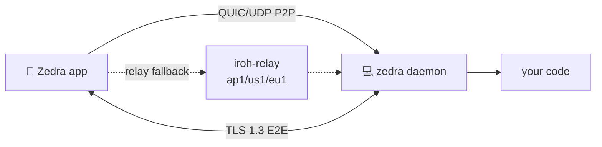

<div align="right">

[](https://github.com/toxicwind/sovereign-projects#license)
[](https://github.com/toxicwind/sovereign-projects)

</div>

# Zedra — the remote code editor

**Your editor, on your phone, over a secure P2P tunnel.** An experimental remote code editor on mobile with GPU-accelerated rendering powered by Zed's GPUI, P2P tunnel over QUIC/UDP by Iroh. Read code, view changes, and run AI agents from anywhere.


## Why should I care?

- **Mobile-first developer experience** — read code, view diffs, run AI agents from your phone
- **Direct P2P when possible** — Iroh over QUIC/UDP, with self-hosted relay fallback (`deploy/relay/`)
- **E2E encrypted** — all traffic encrypted with TLS 1.3; no credentials leave your device

## How it works



1. `zedra start` runs a lightweight daemon on your desktop
2. Phone and desktop discover each other automatically — direct P2P, relay fallback
3. All traffic is encrypted end-to-end with TLS 1.3. No credentials leave your device

## Quick start

```bash
curl -fsSL zedra.dev/install.sh | sh
zedra setup        # install agent hooks for notification
zedra start --detach
```

Scan the QR code with the Zedra app. That's it.

## License & security

- [MIT](https://github.com/toxicwind/sovereign-projects#license) © [Tan Le](https://github.com/tanlethanh)
- **Security model:** e2e encryption, direct connection, zero-trust. Security concerns: [tanle@zedra.dev](mailto:tanle@zedra.dev).
- **Relay:** Zedra uses direct P2P connections when possible, but may fallback to relays if blocked by `Symmetric NAT` or `CGNAT` (common in home networks). Works best on LANs and supported relay regions. Learn more: [How NAT traversal works](https://tailscale.com/blog/how-nat-traversal-works). Self-hosted relay deployment: [`deploy/relay/`](deploy/relay/README.md).

### Agent setup (optional)

Wire Zedra into Claude Code or Codex after install:

```bash
zedra setup claude   # config Zedra skills, hooks for Claude
zedra setup codex    # config Zedra skills, hooks for Codex
```

## Download the app

- **iOS** — [AppStore](https://apps.apple.com/vn/app/zedra-code-from-anywhere/id6760534630) or [TestFlight](https://testflight.apple.com/join/1EWe2kRH)
- **Android** — [Google Play](https://play.google.com/store/apps/details?id=dev.zedra.app)

## Status

Zedra is under active development. Core features are stable and in use — bugs, rough edges, and breaking changes should be expected. Feedback and issues are welcome on [GitHub](https://github.com/tanlethanh/zedra/issues).

## Contribute

The Rust workspace (`crates/`) resolves against the canonical `qed/zed` tree; TypeScript checks via `bun --cwd qed/zedra run check`. Relay ops: [`deploy/relay/`](deploy/relay/README.md).
