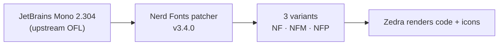

<div align="right">

[](https://github.com/toxicwind/sovereign-projects#license)
[](https://github.com/toxicwind/sovereign-projects)

</div>

# JetBrains Mono — Nerd Fonts build

**The developer typeface, patched for the terminal.** This directory vendors an archived [Nerd Fonts](https://github.com/ryanoasis/nerd-fonts/) build (release **v3.4.0**) of [JetBrains Mono](https://github.com/JetBrains/JetBrainsMono) (version **2.304**) — the monospaced font Zedra renders code in, with icon glyphs baked in so terminal UI and status icons draw correctly.

## Why should I care?

- **No broken glyphs** — Nerd Font patching adds the icon/codepoint coverage a code editor's UI needs (file icons, git symbols, powerline separators)
- **Pinned and vendored** — archived at a fixed release so the editor's rendering never drifts with upstream font changes



## Quick start

```sh
cp *.ttf ~/.local/share/fonts/   # install from this directory
fc-cache -f                      # rebuild the font cache
fc-list | grep -i "jetbrains"    # verify it landed
```

## Which font?

### TL;DR

- If you are limited to monospaced fonts (because of your terminal, etc) then pick a font with `Nerd Font Mono` (or `NFM`).
- If you want to have bigger icons (usually around 1.5 normal letters wide) pick a font without `Mono` i.e. `Nerd Font` (or `NF`). Most terminals support this, but ymmv.
- If you work in a proportional context (GUI elements or edit a presentation etc) pick a font with `Nerd Font Propo` (or `NFP`).

### Ligatures

Ligatures are generally preserved in the patched fonts. Nerd Fonts `v2.0.0` had no ligatures in the `Nerd Font Mono` fonts; this has been dropped with `v2.1.0`. If you have a ligature-aware terminal and don't want ligatures you can (usually) disable them in the terminal settings.

### Explanation

Once you narrow down your font choice of family (`Droid Sans`, `Inconsolata`, etc) and style (`bold`, `italic`, etc) you have 2 main choices:

#### Option 1: Download already patched font

- For a stable version download a font package from the [release page](https://github.com/ryanoasis/nerd-fonts/releases)
- Or download the development version from the folders here

#### Option 2: Patch your own font

- Patch your own variations with the various options provided by the font patcher (i.e. not include all symbols for smaller font size)

For more information see: [The FAQ](https://github.com/ryanoasis/nerd-fonts/wiki/FAQ-and-Troubleshooting#which-font)

[SIL-RFN]:http://scripts.sil.org/cms/scripts/page.php?item_id=OFL_web_fonts_and_RFNs#14cbfd4a

## License & security

- Font licensing: see the [Nerd Fonts](https://github.com/ryanoasis/nerd-fonts/) project and [JetBrains Mono](https://github.com/JetBrains/JetBrainsMono) upstream for license terms (JetBrains Mono is under the OFL). This vendored copy is an archive, not a redistribution decision by this repo.
- This monorepo's own files are [MIT](https://github.com/toxicwind/sovereign-projects#license).
