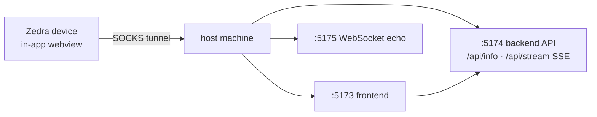

<div align="right">

[](https://github.com/toxicwind/sovereign-projects#license)
[](https://github.com/toxicwind/sovereign-projects)

</div>

# Webview tunnel test app

> **One page that proves the Zedra in-app webview's SOCKS tunnel forwards real TCP streams — HTTP, SSE, and WebSocket — not just simple requests.**

A self-contained localhost web app for manually testing the Zedra in-app webview and its SOCKS tunnel. It runs three loopback servers so a single page proves the tunnel carries genuine bidirectional streams across ports.

| Port | What |
|---|---|
| `http://localhost:5173` | Frontend page (the URL you open in Zedra) |
| `http://localhost:5174` | Backend API — `/api/info` (JSON) and `/api/stream` (SSE) |
| `ws://localhost:5175` | WebSocket echo |

Pure Python standard library — **zero dependencies** (Python 3.8+).

## What to check

- **Page loads** in the native webview (Safari-style bottom bar: back / forward / address pill with lock + reload / share / close)
- **Backend API** — the "BACKEND API" card turns `ok` after tapping *Call /api/info*: proves a second localhost port is reachable
- **SSE** — the "SERVER-SENT EVENTS" card shows a rising tick count: proves streaming responses survive the tunnel
- **WebSocket** — the "WEBSOCKET ECHO" card shows `connected`, and *Send* echoes your text back: proves long-lived bidirectional streams
- **Navigation** — the internal link loads Page 2 and back works
- **Address bar** — tap the address pill, type a host (e.g. `localhost:5174/api/info`), press Go: it navigates; the field lifts above the keyboard



## Quick start

```bash
./examples/webview-tunnel/run.sh
```

Then from a Zedra terminal on the device:

```sh
printf 'http://localhost:5173\n'
```

Tap the underlined link — the page opens in the in-app webview through the tunnel.

## License & security

MIT — see the [canonical LICENSE](https://github.com/toxicwind/sovereign-projects#license). Loopback-only by design: all three servers bind `localhost`, nothing is exposed to the network.

## Native JS bridge (optional)

The page also probes `window.zedra` / `window.webkit.messageHandlers.zedra`. The plain tunnel does **not** wire a bridge, so the "NATIVE JS BRIDGE" card shows `absent` — that is expected.

To see the bridge light up (`present`, messages posted to Rust, `window.zedraSetStatus` driven from `eval_js`), open this page from a webview configured with `on_message`/`inject_js` — see the **Settings → Developer → Webview** test item and [`docs/WEBVIEW.md`](../../docs/WEBVIEW.md).

## Contributing

Keep the app dependency-free — pure stdlib Python is the whole point. New tunnel behaviors get a new card on the page, not a new server.
