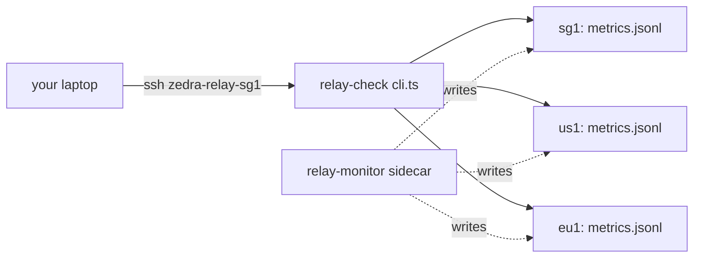

<div align="right">

[](https://github.com/toxicwind/sovereign-projects#license)
[](https://github.com/toxicwind/sovereign-projects)

</div>

# relay-check

> **SSH into the Zedra relay VMs and read their pulse — live metrics or 24h history, from your laptop.**

The laptop-side half of Zedra's relay observability. `relay-check` opens SSH to every relay instance and prints the metrics written by the [`relay-monitor`](../relay-monitor/README.md) sidecar — current load right now, or the trailing history from its `metrics.jsonl` log.

## Features

- 🔌 **One command, all relays** — `INSTANCES=sg1,us1,eu1` fans out over SSH in parallel
- 📊 **Live mode** — current metrics per instance, side by side
- 🕰️ **History mode** — `--history [hours]` replays the sidecar's JSONL log (default: last 24h)
- 🎯 **Targeted checks** — pass an instance name to check just one relay
- 🧩 **Zero config beyond SSH** — instances resolve as `zedra-relay-<instance>` in `~/.ssh/config`

## How it fits together



## Quick start

```bash
# live metrics from every instance
INSTANCES=sg1,us1,eu1 bun cli.ts

# live metrics, one instance
INSTANCES=sg1,us1,eu1 bun cli.ts ap1

# last 24h of history, all instances
INSTANCES=sg1,us1,eu1 bun cli.ts --history
```

## License & security

MIT — see the [canonical LICENSE](https://github.com/toxicwind/sovereign-projects#license). This tool only *reads* metrics over your own SSH sessions; it deploys nothing and changes nothing on the relays.

## Usage reference

| Command | What it shows |
|---|---|
| `bun cli.ts` | Live metrics, all instances in `INSTANCES` |
| `bun cli.ts <instance>` | Live metrics, one instance |
| `bun cli.ts --history` | Trailing history, all instances (default window: 24h) |
| `bun cli.ts <instance> --history <h>` | Trailing `<h>` hours, one instance |

Each instance must resolve as SSH host `zedra-relay-<instance>` in `~/.ssh/config`.

## Architecture

- [`cli.ts`](./cli.ts) — the CLI: SSH fan-out, output formatting, history replay
- [`package.json`](./package.json) — Bun package manifest
- [`tsconfig.json`](./tsconfig.json) — TypeScript config
- [`../relay-monitor/`](../relay-monitor/README.md) — the Docker-side poller that *writes* the metrics this tool reads

## Contributing

Keep the CLI dependency-free and fast — it's a laptop tool. Match the existing `bun cli.ts` invocation style; history parsing must tolerate a truncated last line in `metrics.jsonl`.
