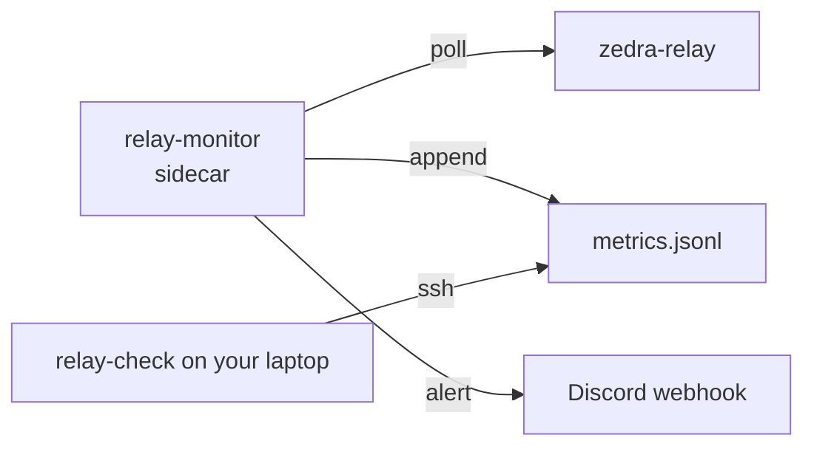

<div align="right">

[](https://github.com/toxicwind/sovereign-projects#license)
[](https://github.com/toxicwind/sovereign-projects)

</div>

# relay-monitor

> **The always-on poller that watches every Zedra relay and writes the metrics your laptop reads.**

Docker-side half of Zedra's relay observability. `relay-monitor` ships beside `zedra-relay` on each relay VM (see [`deploy/relay/docker-compose.yml`](../../deploy/relay/docker-compose.yml)), polls on a loop, and appends to `metrics.jsonl` — the log that [`relay-check`](../relay-check/README.md) reads over SSH.

## Features

- 🐳 **Docker-native** — runs as a sidecar in the relay stack, no host agent needed
- ⚙️ **Env-driven** — reads `INSTANCE` + `DISCORD_WEBHOOK` from the merged `.env`
- 📝 **Append-only metrics log** — `metrics.jsonl`, one line per sample, replayable by [`relay-check`](../relay-check/README.md)
- 🔔 **Discord alerts** — pushes to the webhook in `.env` when a relay misbehaves

## How it fits together



## Quick start

```bash
# build the monitor image (context: repo root; Dockerfile copies this package only)
docker build -f Dockerfile -t zedra-monitor:latest ../..
```

Deploy via [`deploy/relay/deploy.sh`](../../deploy/relay/deploy.sh) — see the [deploy README](../../deploy/relay/README.md).

## License & security

MIT — see the [canonical LICENSE](https://github.com/toxicwind/sovereign-projects#license). Keep `DISCORD_WEBHOOK` out of the repo — it lives in the merged `.env` on the relay hosts only.

## Architecture

| File | Role |
|---|---|
| [`monitor.ts`](./monitor.ts) | The poll loop — collects metrics, writes `metrics.jsonl`, fires alerts |
| [`lib.ts`](./lib.ts) | Shared helpers |
| [`Dockerfile`](./Dockerfile) | Image build (package-only context) |
| [`package.json`](./package.json) / [`tsconfig.json`](./tsconfig.json) | Bun package manifest / TS config |

## Config

| Variable | Meaning |
|---|---|
| `INSTANCE` | Which relay this sidecar watches (e.g. `sg1`) |
| `DISCORD_WEBHOOK` | Alert destination |

## Contributing

The monitor runs unattended on relay VMs — prefer boring, restart-safe code. Metrics format changes must stay backward-compatible with `relay-check`'s history parser.
