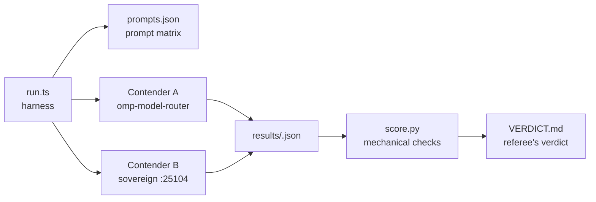

<div align="right">

[](https://github.com/toxicwind/sovereign-projects#license)
[](https://github.com/toxicwind/sovereign-projects)

</div>

# Bake-off: TAU omp-model-router vs Sovereign router

> **A fair, reproducible head-to-head between two LLM routers — same prompts, same harness, no mercy.**

Two contenders, one prompt matrix:

- **Contender A — TAU/oh-my-pi's actual routing extension** (`@cakriwut/omp-model-router` 0.8.9, canonical at `/home/toxic/sovereign/tau-extensions/omp-model-router`). The bench exercises the extension's **real** routing core (`src/routing/compose.ts` `resolveRouting`: heuristic → context promotion → adaptive classifier attempt → image upgrade → tier mapping) and serves the chosen tier model through pi-ai's `streamSimple` — the same provider path the extension's own `provider.ts` uses. The only stub is the model registry (maps `herd/*` refs to the estate's real routers) plus a Bun loader stub for `getAgentDir()`; **no routing logic is stubbed or replaced**.
- **Contender B — Sovereign router** (`:25104`, model `sovereign/free`): `routeFree` → `freeCandidates` → `astRace`, first-substantive-wins, with circuit breakers and local llama-swap fallback roles.

## What gets measured

Per prompt, per contender: routing decision (tier/provider/model for TAU), HTTP status + serving model (Sovereign), serve latency, time-to-first-token (TAU), raw output text, token usage, and every retry attempt. Raw JSON is the record; [`score.py`](./score.py) applies mechanical checks (`exact`, `contains_any`, `python_fib` execution, …) and flags the rest for rubric scoring.



## Quick start

```bash
cd /home/toxic/sovereign/projects/routing/bench
/home/toxic/.bun/bin/bun run.ts --prompts prompts.json --out results/<stamp>.json --legs tau,sovereign --retries 3
python3 score.py results/<stamp>.json
```

**Bun version:** the repo pins bun 1.1.38 via `/home/toxic/sovereign/mise.toml`, but the extension's transitive `embedded-client.generated.txt` is zero bytes and older Bun loaders reject it. Run the harness with bun ≥ 1.4 (`/home/toxic/.bun/bin/bun`). This is a loader compatibility note, not a routing-code change — nothing measured is altered.

## License & security

MIT — see the [canonical LICENSE](https://github.com/toxicwind/sovereign-projects#license). The bench only issues inference requests to routers on this estate; no credentials are stored here.

## Known environment substitutions (disclosed, not hidden)

- The extension's default classifier/tier models are Anthropic (`claude-haiku` etc.); no Anthropic key exists here. Tiers map to live herd models: high → `herd/gemini/gemini-3-flash-preview`, medium → `herd/beellama/qwen-flash-128k`, low → `herd/beellama/exaone-4-0-1-2b-iq4xs`.
- The extension's adaptive classifier was attempted with every available model and is non-functional in this environment (reasoning models burn the hardcoded 200-token budget on thinking tokens; exaone mangles the two-line verdict format). The extension's designed heuristic fallback engages — which is exactly what a user here would get. See [VERDICT.md](./VERDICT.md).

## Files

| File | Role |
|---|---|
| [`run.ts`](./run.ts) | The runner (durable; parametrize via flags) |
| [`prompts.json`](./prompts.json) | The prompt matrix with check specs |
| [`score.py`](./score.py) | Mechanical scoring + manual-review dump |
| [`results/`](./results) | Raw trial JSON (committed; the record of what actually happened) |
| [`VERDICT.md`](./VERDICT.md) | The referee's verdict with dimensions, caveats, and score |

## Contributing

New prompts go in `prompts.json` with a check spec; new contenders get a `--legs` entry in `run.ts`. Never hand-edit `results/` JSON — re-run the harness.
