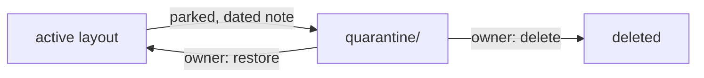

<div align="right">

[](https://github.com/toxicwind/sovereign-projects#license)
[](https://github.com/toxicwind/sovereign-projects)

</div>

# quarantine/

> **The holding pen. Nothing is deleted here — items are parked for review before any destructive call.**

During the 2026-09-19 redo, items removed from the active layout landed here instead of being destroyed. Quarantine is a *decision queue*, not a trash can.

## The policy

- An item lands here with a **dated note**: what it is, why it was parked, where it came from.
- It leaves quarantine by exactly one of two exits:
  - **(a) restored** to the active layout, or
  - **(b) deleted** on explicit owner order.
- There is no third option. Silence is not deletion.



## Quick start

```bash
cat quarantine/MANIFEST.md   # what's parked and why
```

## License & security

MIT — see the [canonical LICENSE](https://github.com/toxicwind/sovereign-projects#license). Contents here are legacy/dead code by definition — do not resurrect anything into the live path without review.

## Currently parked

Nothing yet — the redo was additive. See [`MANIFEST.md`](./MANIFEST.md) for the live inventory.

## Contributing

Parking something? Append a dated entry to `MANIFEST.md` first, then move the files. The note is the price of admission.
