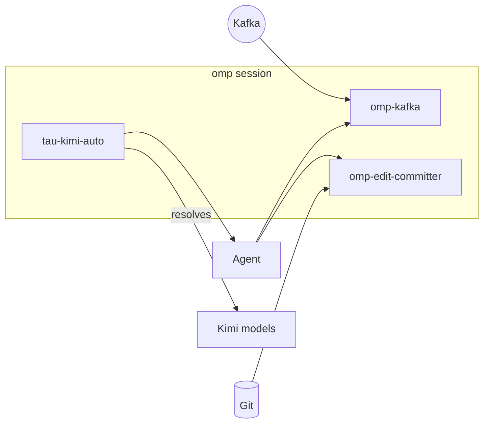

# tau-extensions

<div align="right">

[](https://github.com/toxicwind/tau-extensions/blob/main/LICENSE)
[](https://github.com/toxicwind/sovereign-projects)

</div>

[`toxicwind/tau-extensions`](https://github.com/toxicwind/tau-extensions) —
a curated monorepo of Tau/omp extensions that plug directly into your agent
session. Your agent gets Kafka streams, auto-committed edits, and a
self-healing Kimi alias — install the ones you want, ignore the rest.



## Extensions

| Extension | Category | What it does |
| --- | --- | --- |
| [`omp-kafka`](packages/omp-kafka) | Integration | Consume Kafka topics into an `omp` session; auto (push) and pull modes with `/kafka-*` slash commands and a `kafka_consume` LLM tool. |
| [`omp-edit-committer`](packages/omp-edit-committer) | Workflow | Auto-commit every Edit/Write with a Conventional-Commits message (Intent / Trade-offs / Diagram sections); renders a commit badge under the tool result for use with `modem-dev/hunk`. |
| [`tau-kimi-auto`](packages/tau-kimi-auto) | Model | Registers the `kimi-auto` virtual model — a herd-side alias that resolves to the best healthy Kimi model per request (Kimi-only; 503 instead of silent fallback). |

## Quick start

Requires `omp >= 17.0.0`.

```bash
# clone the monorepo (sparse: only the extensions you want)
git clone --depth 1 --filter=blob:none --sparse \
  https://github.com/toxicwind/tau-extensions ~/.tau/agent/extensions/tau-extensions
cd ~/.tau/agent/extensions/tau-extensions
git sparse-checkout set packages/omp-kafka
cd packages/omp-kafka && bun install && omp plugin link .
```

Drop `--filter=blob:none --sparse` and the `sparse-checkout` line to take
the whole monorepo.

### Install via npm (once published)

```bash
bun add -g @toxicwind/omp-kafka
bun add -g @toxicwind/omp-edit-committer
```

Then add to `~/.tau/agent/config.yml`:

```yaml
extensions:
  - @toxicwind/omp-kafka
  - @toxicwind/omp-edit-committer
```

### Load once for a single session

```bash
omp --extension /path/to/tau-extensions/packages/omp-kafka
omp --extension /path/to/tau-extensions/packages/omp-edit-committer
```

## Architecture

Each package is a self-contained omp extension: an `extension.ts` factory
that registers tools, slash commands, and session hooks. Shared monorepo
tooling is Bun workspaces; packages declare only their own dependencies —
`node_modules/` stays minimal, no transitive junk.

## Config

Each extension is configured independently — see its own README for env
vars and config files:

- `omp-kafka`: `kafka.yml` (resolution order `$KAFKA_CONFIG` → `./kafka.yml` → `./.tau/kafka.yml` → `~/.tau/agent/kafka.yml`).
- `omp-edit-committer`: `OMP_EDIT_COMMITTER_DISABLED=1` / `OMP_EDIT_COMMITTER_DEBUG=1`.
- `tau-kimi-auto`: `KIMI_AUTO_HERD` (default `http://127.0.0.1:25100`), `KIMI_AUTO_STATE`.

## Dev / contributing

```bash
bun install
bun run --workspaces test
bun run --workspaces typecheck
```

All packages typecheck and test cleanly. New extensions go in `packages/`
following the existing `extension.ts` factory shape.

## License & security

MIT — see [LICENSE](./LICENSE).

- Extensions run with full agent privileges inside your Tau session; review
  package source before linking.
- `omp-kafka` SASL credentials go in `kafka.yml`, never in chat or env files
  committed to repos.
