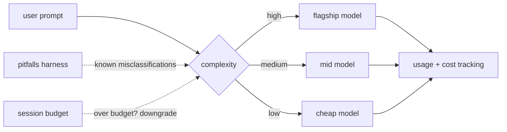

# omp-model-router

<div align="right">

[](https://github.com/toxicwind/sovereign-projects#license)
[](https://github.com/toxicwind/sovereign-projects)
[](https://www.npmjs.com/package/@cakriwut/omp-model-router)

</div>

Stop paying flagship prices for one-line answers. **omp-model-router** is a
cost-optimized routing layer for [Oh-My-Pi](https://github.com/can1357/oh-my-pi):
every prompt is classified as high / medium / low complexity and sent to the
right-priced model — with session budgets, real-time cost dashboards, and an
optional LLM classifier that learns your misclassification patterns.
Integrates with RTK (Rust Token Killer) for 60–90% token savings on tool outputs.

> **Note**: this is a TypeScript source package for Oh-My-Pi extensions. You
> need the OMP environment with `@oh-my-pi/pi-coding-agent` installed.



## Features

- 🎯 **Intelligent routing** — tier-based selection (High/Medium/Low), adaptive
  LLM-powered calibration, manual tier pinning, heuristic refinement
  (clarifications, code edits, planning, explicit speed requests), and
  keyword rule overrides (e.g. `"production" → high`).
- 🧠 **Classifier pitfalls harness** — markdown files that teach the
  classifier known misclassification patterns; no training data required.
- 💰 **Cost optimization** — session budget tracking, automatic downgrade when
  over budget, real-time per-model usage/cost via `/router usage`.
- 🔍 **Observability** — live status widget, detailed usage reports, debug
  mode with session-persisted routing-decision logs.
- ⚙️ **Profiles** — Auto, Deep, Cheap, Hybrid, OSS (bring your own).

## Quick start

```bash
omp plugin install @cakriwut/omp-model-router
```

Then in your next OMP session:

```
/router help
/router status
```

To update: `omp plugin install @cakriwut/omp-model-router --force`
(or in-session: `/router update`).

From source (development):

```bash
git clone https://github.com/cakriwut/omp-model-router.git
cd omp-model-router
bun install
bun run deploy:dev
```

Then `/reload` in OMP. (Source installs use `file:` dependencies and don't
support `/router update` — use the plugin install for production.)

## Architecture

```
src/
├── index.ts       # Extension entry point + lifecycle hooks
├── commands/      # /router subcommands (usage, profile, pin, …)
├── config.ts      # Config loading + validation
├── routing/       # Classification heuristic (High/Medium/Low)
├── provider.ts    # Model provider integration
├── state/         # Session state + budget tracking
├── ui/            # Status widget + usage reports
├── calibration/   # LLM classifier + calibration matrix
├── utils/         # Shared utilities
├── constants.ts / types.ts
test/              # Test suite (~370 tests, bun test)
docs/              # Implementation docs
```

## Commands

| Command | Effect |
| --- | --- |
| `/router` | Show current router status |
| `/router usage` | Model usage and cost breakdown |
| `/router profile <name>` | Switch profile (auto/deep/cheap/hybrid/oss) |
| `/router pin high` | Force high tier until unpinned |
| `/router pin off` | Remove tier pin |
| `/router set budget 3.0` | Set session budget to $3.00 |
| `/router reset` | Reset to config defaults |
| `/router widget on` | Show status widget |

Example `/router usage` output:

```
Router: auto                       $0.1234 / $2.00
████████████████████████████████████████████████ 42 decisions
  high 15%           medium 60%          low 25%

  HIGH    claude-sonnet-4-5                       6x   $0.0800
  MEDIUM  claude-sonnet-4-5                      25x   $0.0350
  LOW     claude-haiku-4-5                       11x   $0.0084

Last: medium → anthropic/claude-sonnet-4-5 (thinking: medium)
```

## Config

Create or edit `~/.omp/agent/model-router.json`:

```json
{
  "routerEnabled": true,
  "defaultProfile": "auto",
  "debug": false,
  "maxSessionBudget": 2.0,
  "rules": [
    { "matches": ["deploy", "production", "release"], "tier": "high",
      "reason": "Safety check for production tasks" },
    { "matches": "changelog", "tier": "low" }
  ],
  "calibration": {
    "enabled": false,
    "mode": "telemetry",
    "classifierModel": "anthropic/claude-3-haiku-20240307",
    "warmupTurns": 5
  }
}
```

| Field | Description | Default |
| --- | --- | --- |
| `routerEnabled` | Enable/disable router | `true` |
| `defaultProfile` | Active profile on start | `"auto"` |
| `debug` | Debug logging to session JSONL | `false` |
| `maxSessionBudget` | Max $ per session (triggers downgrade) | `5.0` |
| `calibration.mode` | `"telemetry"` (data only) or `"adaptive"` (controls routing) | `"telemetry"` |
| `calibration.classifierModel` | Model for the LLM classifier (single string or fallback array) | — |
| `rules` | Keyword → tier mappings | `[]` |

### Classifier pitfalls harness

When a classifier is active, the router injects a pitfalls file (known
misclassification patterns) into the classifier prompt:

1. `pitfallsPath` config field (explicit override),
2. `model-router-pitfalls.md` in the project directory,
3. `~/.omp/agent/model-router/pitfalls.md` (global; starter file with 10
   common pitfalls installed automatically — see `pitfalls.example.md`).

Plain markdown, `##` headings per pitfall, two to three lines each. Cached
in-process after first read; changes take effect on `/reload`.

## Dev / contributing

```bash
bun install
bun run test          # summary output when green (recommended)
bun run test:verbose  # dots reporter, full traceability
bun run deploy:dev    # deploy to ~/.omp/agent/extensions/model-router
```

Then `/reload` in OMP. Releases: `bun run release:patch|minor|major`
(runs tests, bumps version, tags, triggers the GitHub Actions
publish workflow — one-time setup: NPM automation token in the
`NPM_TOKEN` repo secret). Manual fallback:
`npm publish --access public && gh release create vX.Y.Z --generate-notes`.

Related docs: `docs/FALLBACK_TESTING_GUIDE.md`,
`docs/BEST_PRACTICES_AUDIT.md`, `docs/RTK_INTEGRATION.md`,
`docs/CALIBRATION_DESIGN.md`.

## Troubleshooting

**"Router not active"** — check `routerEnabled: true`, config file exists at
`~/.omp/agent/model-router.json`, run `/router`, then `/reload`.

## License & security

MIT © Riwut Libinuko — see [LICENSE](./LICENSE).

- The router never sends your prompts anywhere except the models you
  configured; the classifier model only ever sees the prompt for tiering.
- Debug logs (`debug: true`) may contain prompt text — keep session JSONL
  out of shared repos.
