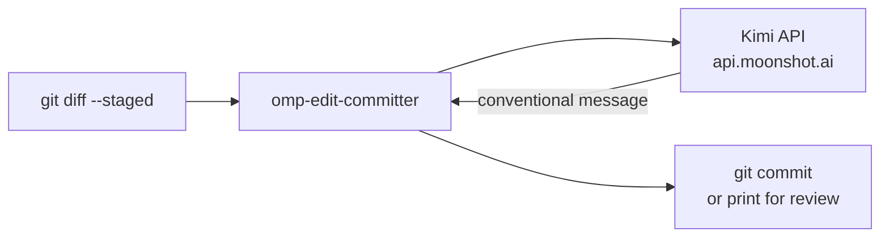

<div align="right">

[](https://github.com/toxicwind/sovereign-projects#license)
[](https://github.com/toxicwind/sovereign-projects)

</div>

# omp-edit-committer

Automatic commit-message generation from staged edits: reads the git diff, asks Kimi for a message, and commits — conventional-commit style, in one command.

> Writing commit messages is a context switch that produces worse messages the more tired you are. This tool reads the staged diff and generates the message for you — scoped, conventional, and consistent — while you stay in flow.

## Features

- **Diff-driven messages** — staged diff in, conventional message out
- **Conventional style** — `type(scope): subject` with body
- **One command** — generate and commit, or print for review
- **Kimi-backed** — Moonshot models with long context for big diffs

## Flow



## Quick start

```bash
export MOONSHOT_API_KEY=sk-...
git add -A
npx omp-edit-committer
```

Review mode:

```bash
npx omp-edit-committer --dry-run   # print the message, don't commit
```

## License & Security

**License:** MIT — see [LICENSE](https://github.com/toxicwind/sovereign-projects#license).

**Security:** the staged diff is sent to the Moonshot API for message generation — never stage files containing secrets before running this. The API key resolves from `MOONSHOT_API_KEY` at runtime; never commit it.

## Configuration

| Env / option | Meaning |
|---|---|
| `MOONSHOT_API_KEY` | Moonshot API key (required) |
| `KIMI_MODEL` | Model override (default `kimi-k2`) |
| `--dry-run` | Print the message without committing |
| `--amend` | Amend the generated message onto HEAD |

## Development

```bash
cd extensions/packages/omp-edit-committer
bun install
bun test
```
