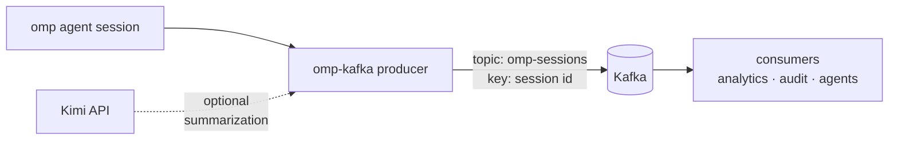

<div align="right">

[](https://github.com/toxicwind/sovereign-projects#license)
[](https://github.com/toxicwind/sovereign-projects)

</div>

# omp-kafka

Kafka streaming integration for omp sessions: publish session events to Kafka topics and consume them downstream — session analytics, audit logs, and multi-agent coordination over a durable event backbone.

> Session events are valuable beyond the session: audit trails, usage analytics, fan-out to other agents. omp-kafka puts them on Kafka — a durable, replayable stream — so downstream consumers get every event without coupling to the agent process.

## Features

- **Event publishing** — session events → Kafka topics as JSON records
- **Durable streams** — replayable history per session key
- **Consumer support** — typed consumer for downstream processing
- **Kimi enrichment** — optional Kimi-powered event summarization

## Architecture



## Quick start

```bash
export MOONSHOT_API_KEY=sk-...
npx omp-kafka --topic omp-sessions --brokers localhost:9092
```

## License & Security

**License:** MIT — see [LICENSE](https://github.com/toxicwind/sovereign-projects#license).

**Security:** session events contain prompts and tool results — a Kafka topic is a broadcast medium. Restrict topic ACLs, enable TLS/SASL on the brokers, and treat the stream with the same care as the session logs. `MOONSHOT_API_KEY` resolves from the environment at runtime; never commit it.

## Configuration

| Env / option | Meaning |
|---|---|
| `--brokers` | Kafka broker list (default `localhost:9092`) |
| `--topic` | Topic for session events (default `omp-sessions`) |
| `--group-id` | Consumer group id |
| `MOONSHOT_API_KEY` | Moonshot key for optional event summarization |
| `KIMI_MODEL` | Model override (default `kimi-k2`) |

## Usage

Producer (publish session events):

```bash
npx omp-kafka produce --topic omp-sessions --brokers localhost:9092
```

Consumer (read them back):

```typescript
import { createConsumer } from "omp-kafka";

const consumer = createConsumer({ brokers: ["localhost:9092"], groupId: "audit" });
await consumer.subscribe("omp-sessions");
for await (const event of consumer.events()) {
	console.log(event.sessionId, event.type);
}
```

## Message format

```json
{
	"sessionId": "2026-09-30-120400",
	"type": "tool_execution_end",
	"timestamp": "2026-09-30T18:04:00.000Z",
	"payload": { "toolName": "read", "path": "src/index.ts" }
}
```

Records are keyed by session id, so all events for one session land on the same partition in order.

## Development

```bash
cd extensions/packages/omp-kafka
bun install
bun test
```
